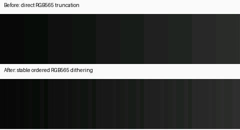

# Pimoroni Presto receiver

Presto runs a small MicroPython receiver; the CastKit remote-display worker runs
the browser. The unit shows existing CastKit views at **480×480**, sends taps and
swipe contacts back to that same browser, and needs only USB power after
provisioning. It does not run Linux, JavaScript, Chromium or ESPHome.

## Install one unit

1. Install Pimoroni's [Presto MicroPython firmware](https://github.com/pimoroni/presto/releases).
   The regular UF2 preserves the filesystem. Back up the existing `main.py` and
   `secrets.py` before replacing them; the `with-filesystem` UF2 erases user files.
2. Connect with `mpremote`, record `machine.unique_id()` and the Wi-Fi MAC from
   `network.WLAN().config("mac")`, and register the unit in CastKit with its real
   MAC, 480×480, square, full color and touch. The remote worker uses the browser
   device registry because it renders the standard `/d/<id>` client. Set repaint
   to `fast` so views respect the transport's actual refresh budget. Enable the
   view drawer if wanted. Register native backlight support
   (`hasRemoteBacklight: true`, `hasMqttBacklight: false`). CastKit uses one
   Backlight control surface and mirrors this native controller over MQTT when
   a broker is configured; no transport choice is needed in the management form.
3. Copy `secrets.example.py` to a private `secrets.py`; configure Wi-Fi, the relay
   host/port and a dedicated random token of at least 32 characters. Upload that
   file, `main.py` and `pixels.py` to the board root, then reset it. `main.py` starts at boot.
4. Run the existing `castkit-remote-display` image with `relay.example.yaml` as
   `/config/display.yaml`. Mount a private YAML containing `presto_token` at the
   configured `secrets_path`. Its value must match the board's `CASTKIT_TOKEN`.
   The manifest URL must identify this unit. The container runs as UID 10001;
   its configuration and secret mounts must be readable by that UID.
5. Select Touch Test and confirm every corner and the center **on the glass**.
   A server screenshot cannot prove the physical panel or touch coordinates.
   Reset the board and restart the worker; check that frames resume each time.

## Transport and measurements

The relay binds `listen_port` on a trusted private LAN. The current board client
uses plain HTTP; keep this listener private. The dedicated bearer token and MAC
binding authorize only this unit's frame/touch exchange, never CastKit management.
The worker's connection to CastKit can use HTTPS and optional read-only browser
storage state. Source-service and management credentials never reach the board.

`GET /frame?after=<id>` waits up to one second for the next frame, returning 204
while unchanged. Old clients receive a complete zlib-compressed **big-endian
RGB565** frame (`application/vnd.castkit.rgb565+zlib`), exactly 460,800 decoded bytes.
New clients advertise `X-CastKit-Accept: rgb565-patch-v1` and receive
`application/vnd.castkit.rgb565-patch+rle` or `+zlib`, with `X-CastKit-Rect`
(X,Y,width,height) and `X-CastKit-Base-Frame`. A patch is relative only to the last
physically acknowledged image; a missing base, reconnect or reboot gets a full
frame with base 0. Unchanged heartbeats use a one-pixel patch.

RLE blocks contain a little-endian 16-bit control (low 15 bits: pixel count minus
one; high bit: repeat), followed by one repeated pixel or the literal pixel bytes.
The **pixel bytes remain big-endian** in both encodings. The encoder favors RLE
unless its excess over DEFLATE exceeds 10% of the rectangle's raw size
(capped at 24 KB), trading a small transfer increase
for much faster native decoding. Bounded Viper routines decode into PicoGraphics'
back buffer or a temporary rectangle buffer, then copy the rectangle into the
back buffer. `update()` runs once per complete image; frames never reach flash.
Touch sampling pauses during decode and drawing. Once the new image is visible,
sampling resumes with that image's frame id while its acknowledgement travels.
Those contacts remain queued until acknowledgement succeeds, so the worker's
acknowledged-frame guard remains authoritative. A failed acknowledgement discards
the queued contacts and requests a full recovery frame.
`POST /ack` confirms that decode and drawing finished. `POST /touch` sends bounded
batches of sequence/phase/X/Y/displayed-frame-id samples. Every call carries the
dedicated token, MAC and a new identity for each board boot.

Acknowledgements include `body_read_us`: device time spent reading and copying
the HTTP response body. It excludes waiting for response headers or an idle long
poll, but includes TCP/Wi-Fi waits and device-side copies. It is not a measurement
of radio throughput alone; decode and display update timings remain separate.

The worker guards contacts against the **acknowledged** image: a stale frame
cannot activate a replacement control at the same coordinates. Input is disabled
after seven seconds without a fresh frame; after fifteen seconds the panel shows
a connection notice. Wi-Fi and server failures retry, and a board reboot resets
the touch sequence. The transport caps capture at eight frames per second; this is
a ceiling, not a guaranteed end-to-end frame rate. Heartbeats refresh unchanged
images every two seconds to keep freshness meaningful.

The first full-resolution test measured approximately **500 ms PNG decode**. The
native-pixel path reduced that to **260–275 ms inflate plus 24 ms buffer update**.
The patch receiver reduced a full UI RLE decode to about **81 ms** in a physical
benchmark; measured music-progress rectangles decoded in **6 ms** with the same
24 ms display update. Photos may still need DEFLATE. These are decode times,
not end-to-end touch latency. Direct Chromium captures avoid screenshot stability
waits; the USB-powered board disables Wi-Fi power saving to reduce delivery
latency. Frame/ack HTTP requests reuse one connection; touch uses a separate
connection so long polling cannot delay input. Broken or cancelled requests
discard their connection before retrying. Network and browser capture still add latency.

Stable ordered dithering during RGB565 quantization softens artwork gradients.
It does not increase the panel's color depth; pixel bytes and primary colors remain
unchanged. The pattern stays anchored to screen coordinates across patch updates. Solid
8×8 tiles retain their flat fill so UI backgrounds still compress efficiently.

 This receiver is suitable for
information panels and deliberate taps; smooth animation and video need a more
capable client or further optimization. These measurements are from one unit,
not a promise for every Wi-Fi network or view.

Unauthenticated `/healthz` exposes build markers, last-seen age, frame and touch
counts, and the latest decode/draw timings. Optional `preview_port` serves the
existing read-only JPEG/MJPEG preview; leave it off unless needed.

## ESPHome alternative

ESPHome's [RP2 platform](https://esphome.io/components/rp2/) supports RP2350 boards,
including Pico 2 W. Its stock [MIPI RGB display driver](https://esphome.io/components/display/mipi_rgb/)
requires ESP32/ESP-IDF, so it is not a drop-in Presto driver. An ESPHome experiment
would need Presto's RGB/PIO scanout, PSRAM and CYW43439 wiring plus touch support.
MicroPython remains the tested receiver; ESPHome on this board has not been flashed
or verified.

## Backlight and room following

In CastKit management, open the device's **Backlight** tab. The brightness slider
(0–100%) and On/Off buttons apply immediately and reflect external changes.
Settings are saved to the platform configuration, survive server/board restarts,
and travel over the authenticated frame connection. They require no MQTT broker
or Home Assistant automation. The worker reads the manifest's same-origin
`controls_url` every 500 ms; `X-CastKit-Backlight` is delivered on both image and
unchanged-image responses. Firmware applies `Presto.set_backlight(percent / 100)`
and acknowledges the applied value. Relay health separates requested and reported
percentages. Touch input is suppressed while the light is off.

When a broker is configured, the same backlight is controllable through Home
Assistant's MQTT light entity. Native commands and MQTT commands update one
persisted controller; MQTT state is mirrored without requiring a separate device
agent. Leave **Room following (optional)** disabled when Home Assistant automations
already coordinate the display with room lights.

**Follow room lights** selects an `entities.v1` channel and a light or switch. Any
CastKit source can supply it. A current `on` state restores the saved brightness;
`off` extinguishes the backlight. An unavailable/stale source holds the last known
power during the current server process; after a server restart it starts off
until a valid room state arrives. Manual On/Off overrides room following. The
optional room rule needs its source; manual controls continue to work without it.

Horizontal artwork drags remain on the original Now Playing control, so a left
drag past its threshold skips forward and a right drag skips backward. Vertical
swipes still cancel taps before dispatching view navigation. Both remote-display
transports share this routing fix.
