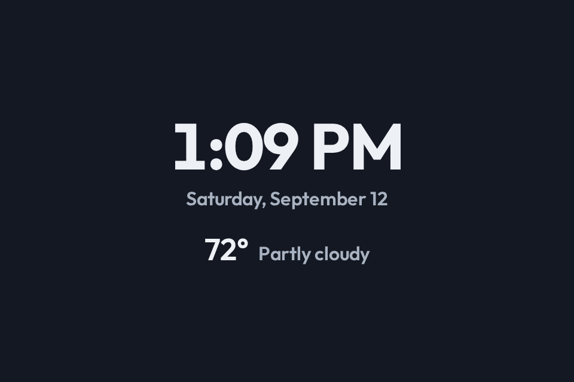
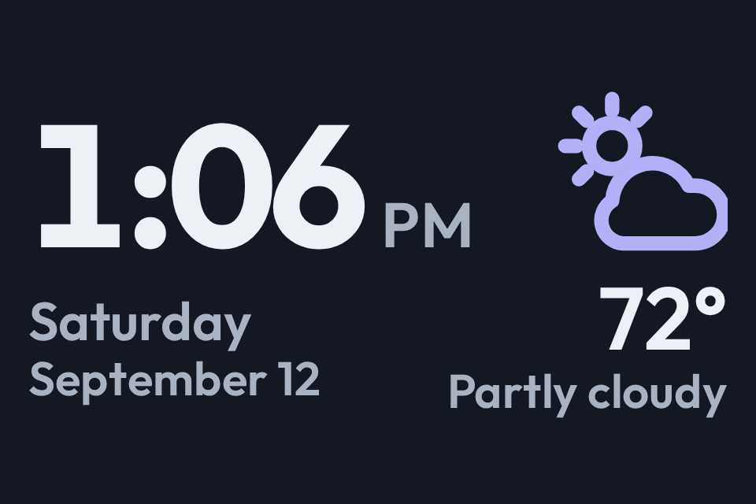
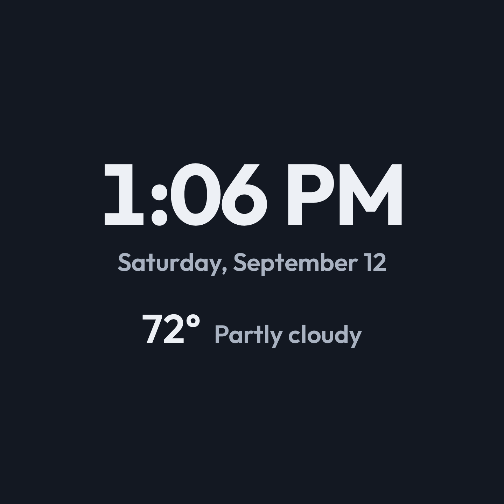

# Unifying CastKit: one view vocabulary, properties not panel types

**Date:** 2026-09-12, revised 2026-09-13 · **Status:** Plan, phase 0 done,
phase 1 not started · **Decisions:**
[one app, one vocabulary](decisions/2026-09-12-castkit-is-one-app-with-one-view-vocabulary-not-inkcast-plus-slatecast.md),
[CastKit owns every control](decisions/2026-09-12-castkit-owns-every-control-and-home-assistant-mqtt-is-only-the-automation-surface.md),
[HA only switches views](decisions/2026-09-12-home-assistant-only-switches-views-and-castkit-owns-interactivity-and-delivery.md),
[a display is a panel model plus an installation](decisions/2026-09-13-a-display-is-a-panel-model-plus-an-installation.md),
[CastKit stamps the properties](decisions/2026-09-13-castkit-stamps-a-panels-properties-and-a-view-never-asks-the-browser-what-the-panel-is.md),
[Storybook names a property](decisions/2026-09-13-storybook-names-a-view-and-a-property-never-a-panel-technology.md)

Read the decision records first. They are the settled rules. This file is
only the order of work and the traps in it.

⚠️ **Revised 2026-09-13, twice.** The property vocabulary is settled: a display
is a **panel model plus an installation**, and every value states what it
changes ([rule](decisions/2026-09-13-a-display-is-a-panel-model-plus-an-installation.md),
[reference](display-properties.md)). The Storybook taxonomy moved from "not in
scope" into phase 0, and visual regression testing joined as phase 6.

## What is actually split today

| Thing | Image half | Live half |
| --- | --- | --- |
| View names | `packages/shared/src/views/viewNames.ts` (9 names) | `packages/server/src/views/browserRegistry.ts` (7 names + external views) |
| View components | `@castkit/views`, React, inline styles, Satori-safe | `@castkit/slatecast`, Preact, `styles.css`, `vw`/`vh`/`vmin` |
| Name to element | `packages/server/src/views/registry.ts` | the SPA switches on `clientId` |
| HA View select options | `buildDiscoveryMessages` | `buildBrowserDiscoveryMessages` |
| Storybook | `@castkit/web` | `@castkit/slatecast` |
| Active view store | `deviceStore` | `stateStore` |

Five of the nine image names and four of the seven live names are the same view
under a different name. The mapping is in the
[vocabulary decision](decisions/2026-09-12-castkit-is-one-app-with-one-view-vocabulary-not-inkcast-plus-slatecast.md).

## The order of work

### Phase 0 — the taxonomy, and two bugs in the review surface (done 2026-09-13)

Ahead of any type change, the things a reader trips over:

- **Storybook stopped naming panel technology.** `Browser views/<name>` became
  `Views/<name>` in both builds, `Overview/All browser screens` became
  `Overview/All screens`, and the composed refs became
  `CastKit — server-rendered frames` and `CastKit — panel-rendered views`.
- **Four story names claimed `M5Paper mono (540×960)`** while rendering the
  registered 960x540 canvas. Corrected.
- **The all-screens matrix booted 35 Storybook previews at once.** Measured on
  the deployed site: 400 requests, 42 MiB, about 25 seconds, and the owner's
  machine pinned throughout. The cells are `loading="lazy"` now — 129 requests,
  16 MiB, 9 booted cells locally.
- **The kiosk's `cursor: none` sat on `html, body` in a stylesheet Storybook
  also loads**, so the pointer vanished over the whole Storybook canvas, not
  just inside a panel. It sits on `.stage` now, which is the appliance.

### Phase 1 — one name list, two renderers behind it

Move the view vocabulary into one exported list in `@castkit/shared` that both
registries resolve against. Each entry declares the **properties** it needs, not
a client mode:

```ts
{
  name: "Clock (Weather)",
  requires: {
    input: "any",           // "touch" when a view cannot degrade to display-only
    valueLifetimeMs: 60_000, // it prints the minute, so it needs a panel that can repaint in 6 s
  },
}
```

The requirement names a **property** from axis A, or the **lifetime of the
shortest-lived value the view prints**. `getViewsForDevice` then compares that
lifetime against the panel's repaint time by the freshness rule — ten to one —
so no list of allowed views has to be hand-maintained per panel. It never names
a delivery mode, a panel technology or a device id.

⚠️ **This phase is where the live defect closes.** Today `packages/server`
offers all nine view names to every image-mode device, and `startClockTicker`
re-pushes any device on a clock view every minute. The Impression is offered
three clock views and flashes for 28 seconds each time it takes one.

`getViewsForDevice` then answers "what can this panel do" from the device's
properties alone, and both discovery builders publish its answer. Nothing about
"image mode" or "browser mode" appears in the predicate.

⚠️ **The rename is a live-fleet migration, not a refactor.** `Ambient` and
`Calendar` are the current values of two retained MQTT `view` state topics and
two Home Assistant `select` states, and `Clock (Agenda)` / `Clock (Weather)` are
two more. Accept both the old and the new name on `view/set` for one release, map
the old to the new, and publish only the new one. A select whose retained state is
a name the new build does not offer reads `unknown` and the panel falls back to
the first view in the list.

⚠️ **`script.control_castkit_display_view` in Home Assistant takes `agenda_view`
and `plain_view` as parameters purely because of this split.** When phase 1 ships,
give those fields defaults and drop the arguments from all four callers. That
script is the measure of whether the phase worked: if it still needs to be told
which pair of names a display speaks, the vocabulary is still split.

### Phase 2 — the layout variants key on properties, in one place

The two halves already branch on panel shape; they just do it separately and by
different rules.

- `useIsShortPanel` + `styles.css` carry `(min-aspect-ratio: 5 / 4) and (max-height: 400px)` for the live half.
- `registry.ts` carries `COMPACT_PANEL_MAX_HEIGHT = 200` for the image half.

Both express "this panel is short, lay out beside instead of stacked". Name the
property once, derive both tests from it, and delete the second constant.

The installation settings (`orientation`, `power`, `margins`, `crop`, `mask`)
are the other half of this phase. They are per unit, not per model, so a second
M5Paper hung portrait is one more installation rather than a second panel entry.

**Battery lands here too, and it is three separate pieces of work**
([decision](decisions/2026-09-13-a-battery-is-a-panel-fact-a-power-source-is-an-installation-and-charge-is-telemetry.md)):

1. `hasBattery` on the panel record and `power` on the installation, with
   `getViewsForDevice` dropping a `battery` install one repaint grade.
2. A `castkit/<id>/battery` state topic and its discovery payload — a
   `device_class: battery` sensor plus a binary sensor for `isOnBattery`, on the
   CastKit device. The M5Paper firmware already publishes that JSON as of
   2026-09-13, so the server side is the missing half.
3. The low-battery end state: stop repainting the view and paint one notice.
   This is not a cosmetic nicety on ePaper — a panel that simply stops keeps
   showing a stale frame that reads as a working display.

An on-glass battery indicator is deliberately NOT in this list. It is a visible
design choice and needs its own decision.

**This is also where the stamp lands**
([decision](decisions/2026-09-13-castkit-stamps-a-panels-properties-and-a-view-never-asks-the-browser-what-the-panel-is.md)).
`:root` carries `data-shape`, `data-color`, `data-input`, `data-repaint`,
`data-delivery` and the `--panel-*` custom properties, written from the device
record by each renderer.

⚠️ **The stamp is not additive on the live half — it needs the protocol first.**
`BrowserDeviceProfile` carries three of the eight panel facts today (`shape`,
`hasTouch`, `color`). `repaint`, `hasPanelDithering`, `pixelGrid` and `delivery` are
not on the wire at all, and `delivery` is the one the SPA cannot infer: the same
Preact app serves a HyperPixel kiosk (`live-browser`) and the WT32-SC01, where a
server-side headless browser renders this app and pushes finished frames
(`pushed-frames`). Extend the snapshot message in the same change, or the stamp
will assert `live-browser` on a panel that has no browser.

First concrete debt this repays: **`Ambient` never got the short landscape layout
that `Clock`, `Weather` and `Calendar` got on 2026-09-11**, so on the 480x320
workbench panel it rendered its date and condition at 16 px. It is now the view an
empty day lands on, so it is read daily. **Fixed on 2026-09-12** — but by hand,
one view at a time, which is exactly what phase 2 is meant to stop. A shared
property test makes that class of miss impossible.

Before, at true size on the 480x320 panel — time 54 px, date 16 px,
temperature 26 px, condition 16 px, no condition mark:



After — time 110 px, weekday 34 px over the month and day at 30 px,
temperature 56 px, condition 30 px, and the drawn condition mark:



Second concrete debt, same day: **Now Playing's art size was the same number
written three times** — the grid column, the artwork width and the artwork
height — so "make the picture smaller" was a three-place edit with two chances
to leave one behind. It is now one `--art-size` declaration and the text column
is derived from it
([decision](decisions/2026-09-12-the-short-panels-now-playing-art-is-216px-and-the-album-may-take-a-third-row.md)).
That is the phase 2 shape in one view. Phase 2 is naming the *panel* property
the whole media query keys on, so no view can be missed the way `Ambient` was.

The 720x720 square is untouched, measured byte-for-byte at the old `vmin`
sizes (122 px time, 36 px date):



### Phase 3 — the variants that are really settings

Three view names are one view plus a setting, and they should become one name plus
a setting in the admin panel:

- `Now Playing (Dashboard)` and `Now Playing (Poster)` — a layout choice.
- `Photo Frame`, `Photo Frame (Fill)`, `Photo Frame (Duo)` — a composition choice
  the photo adapter already makes; see
  [2026-07-12-dual-portrait-photo-layout.md](decisions/2026-07-12-dual-portrait-photo-layout.md).
- `Agenda` against `Clock (Agenda)` — the clockless variant exists because a
  repaint is expensive, which is a panel property
  ([2026-07-27](decisions/2026-07-27-clockless-agenda-view.md)). It should be
  derived, not chosen by name.

This shrinks the View select to the list a person actually thinks in, which is
also the list Home Assistant should be offered.

### Phase 4 — shrink the Home Assistant surface

Per the [control-ownership decision](decisions/2026-09-12-castkit-owns-every-control-and-home-assistant-mqtt-is-only-the-automation-surface.md),
stop mirroring knobs nobody automates. Candidates, all already in the admin panel:
the four margin sliders, the four photo-crop sliders, the dither select, the
rotation select.

⚠️ **The retained state topic is today's persistence for these values.** Removing
a knob's discovery payload without moving its persistence first loses the value on
the next restart. Move persistence into CastKit's own store in the same change,
and publish an empty payload to the discovery topic so Home Assistant removes the
entity rather than leaving it orphaned and `unavailable`.

### Phase 5 — retire the names

`@castkit/slatecast` as a package name, `inkcast/` as the ePaper fleet's topic
base, `INKCAST_*` env vars, `Inkcast Server` as the HA device name, and
`script.control_inkcast_epaper_display`. Last on purpose: each one is a live
identifier, the topic migration is already gated
([2026-07-07](decisions/2026-07-07-flat-castkit-topics-migration-gated.md)), and
none of them is what the owner is actually asking to fix.

### Phase 6 — a snapshot per (view, profile)

There is no visual regression testing in this repo today. The all-screens
matrix is the manual substitute, and it only catches what somebody looks at.

The unit is the story, because the story is already the (view, profile) pair.
What that buys: a change that only affects round panels fails only the round
cells and names them; a change that affects every panel fails everything and
says so in one run.

Two constraints the harness has to meet:

1. **It must drive the panel document, not a scaled preview.** Slatecast lays
   out in `vw`/`vh`/`vmin`, so a snapshot taken at any viewport other than the
   panel's own size is a picture of a layout no panel shows — the mistake
   [2026-09-13](decisions/2026-09-13-a-panel-story-renders-in-its-own-iframe-not-a-storybook-viewport.md)
   was written about.
2. **The ePaper half must snapshot the dithered output, not the source
   render.** The dither is the part that differs per panel, and an undithered
   snapshot would pass while the panel shows mud.

Playwright is already a dependency and already drives a real Chromium here, so
the cheapest first cut is a spec that walks the built `index.json`, opens each
story's panel document at its own size, and compares against a committed PNG.
Storybook's own test-runner is the alternative and brings its own runner.
Neither is chosen yet.

## What is deliberately NOT in scope

- **Merging the two renderers into one component tree.** `@charcuterie/ui` is
  React and Slatecast is Preact under a 60 KB gz budget; `preact/compat` is ruled
  out. One vocabulary and one property model do not require one component library
  — see [the M5b handoff](../../charcuterie/docs/2026-07-31-m5b-castkit-the-second-consumer.md).
- **Folding the two Storybook BUILDS into one.** ⚠️ Narrowed 2026-09-13: the
  taxonomy is no longer out of scope and was unified in phase 0. What stays out
  is one *build*, and only because no single framework can host both renderers.
  The refs are named for the renderer now, not for panel technology.

## Done when

1. One exported view-name list, and `rg -uu "Ambient|Slatecast view"` finds no
   second vocabulary.
2. `script.control_castkit_display_view` is called with no view-name arguments.
3. A view's layout variant names the property it keys on, in one place.
4. Home Assistant's CastKit entities are the automatable set and nothing else.
5. A fresh clone with no broker configured can set every setting in the admin
   panel.
