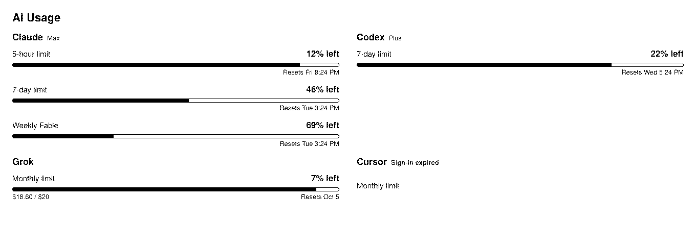
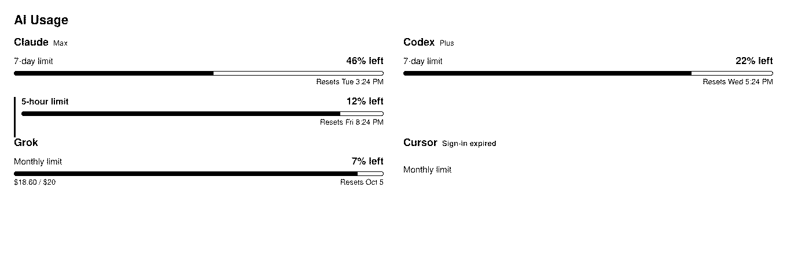

# AI Usage view

How much of each AI subscription is left, and when the next window resets. One
section per provider, and one row for that provider's weekly limit.


## Where the data comes from

The **AI Usage** collector, over a channel of type `ai-usage.v1`. Provider credentials stay in that service. CastKit reads
only the normalized snapshot, so it holds no API key and opens no session with
Anthropic, OpenAI, xAI or Cursor.

Two adapters fill the channel. Pick one.

| Adapter | Use it when | Channel setting |
| --- | --- | --- |
| **MQTT** | The collector already publishes to your broker. | `topic` = `ai-usage/state` |
| **AI Usage** | There is no broker, or you prefer a direct read. | source `url` = the collector's base URL |

The MQTT adapter takes the producer's document unchanged; nothing has to be
republished in a CastKit-specific shape. The direct adapter polls
`GET /api/state` every 300 seconds by default, which is the collector's own
refresh rate — a faster poll reads the same answer back.

Both accept a `providerIds` channel setting. Leave it empty for every provider.

## The contract

```ts
{
  providers: [
    {
      id: "claude",
      name: "Claude",
      isOk: true,
      planText: "Max",          // optional
      problemText: "…",         // optional; why the provider is unreachable
      isCached: true,           // optional; a last-good answer during a backoff
      windows: [
        {
          id: "session_5h",
          label: "5-hour limit",
          periodHours: 5,       // optional; how long the window spans
          percentUsed: 7,       // optional; absent means "not reported"
          resetsAtMs: 1764000000000,  // optional
          usedText: "$18.60 / $20",   // optional
        },
      ],
    },
  ],
  fetchedAtMs: 1763990000000,   // optional
  isMock: false,                // optional
}
```

## What the view decides

**One row per provider: its weekly limit.** A panel is read from across a desk,
not scanned like a table, so the view answers one question — how much of the
week is left — and stays quiet about the rest. The headline is the longest
window that is not longer than a week. A provider whose windows are all longer
than a week gives up its shortest one instead, which is the nearest thing it
has to a weekly figure.





**A second limit appears only when it is at or past 80 percent.** Below that it
is not drawn at all. The threshold is the panel's `alertPercent` setting, so a
display that wants every window can set it to zero. An escalated row is marked
with a rule down its leading edge and a heavier label, never with color: a
1-bit panel has no color to spend, and the exception has to survive the dither.

**A limit the rule withheld is never counted as missing.** The overflow line
reports only rows that did not fit on the glass. Counting a withheld limit
would send the reader looking for something the view decided was not worth
their attention.

**The window's span comes from `periodHours`, never from `resetsAtMs`.** A
reset time says when the counter next clears; it says nothing about the span
being counted. A five-hour window one minute old resets further out than a
weekly window on its last day, so ordering by reset time puts the session
limit first about half the time. The source infers the span from the
producer's own wording — `5-hour session`, `Weekly (all models)`, `7-day
limit`, `Monthly allowance` — and leaves a window it cannot classify
unclassified rather than guessing. A producer may state `period_hours`
outright and that always wins.

**On a monochrome panel every bar fill is the body ink.** An accent-blue fill
quantizes to a half-tone hatch while a danger-red one quantizes to solid
black, so the same bar at 72 percent and at 100 percent came out looking like
two different kinds of measurement.

**The bar shows what is spent; the number says what is left.** A nearly full
bar and `7% left` are the same fact twice, and that is the point — the bar is
what the eye reads across the room, the number is what a person reads up close.
The wording follows AI Usage's own card so the panel and the web page never
disagree.

**A window at 75 percent turns the bar to the warning color, and 90 percent to
the danger color.** Nothing else on the row changes. On a monochrome panel
neither applies.

**A reset time is absolute unless two things are true.** The panel must repaint
faster than the value moves, which is the
[freshness rule](display-properties.md), and the reset must be less than a day
away. `Resets in 3h 0m` is useful; `Resets in 240h 0m` passes the freshness
rule on a live browser panel and still fails the reader. Beyond a day the view
says `Resets Tue 2:00 AM`, and beyond a week `Resets Oct 5`.

**Only rows that finish on the glass are drawn**, the same budget the
[agenda view](decisions/2026-09-14-an-agenda-view-draws-only-the-rows-that-finish-on-the-panel.md)
keeps. A provider joins the list only when its heading and at least one of its
chosen rows both fit. Whatever was dropped is counted on the last line.


**A panel too short for one whole row still says something true.** It names the
window closest to spent, which is the one worth the glass.


**A provider CastKit cannot reach keeps its row** and says why. Dropping it
would make an outage look exactly like a healthy display.

## Settings

| Setting | Default | What it does |
| --- | --- | --- |
| `alertPercent` | `80` | How spent a non-headline limit must be before it earns a row. `0` shows every window. |

## Panels

The view is laid out in one column. That is right for a panel roughly 2:1 or
squarer, and wrong for a letterbox. On the 1360 x 480 Waveshare 10.85 inch
panel a single column runs out of height after three providers while two
thirds of the glass stays empty. A column layout for wide panels is drawn and
not yet built; see the preview gallery linked from the decision record.

## Decision records

- [AI Usage is a native view on an `ai-usage.v1` channel](decisions/2026-09-25-ai-usage-is-a-native-view-on-an-ai-usage-v1-channel.md)
- [The AI Usage view shows one weekly limit per provider and escalates the rest](decisions/2026-09-25-the-ai-usage-view-shows-one-weekly-limit-per-provider.md)
