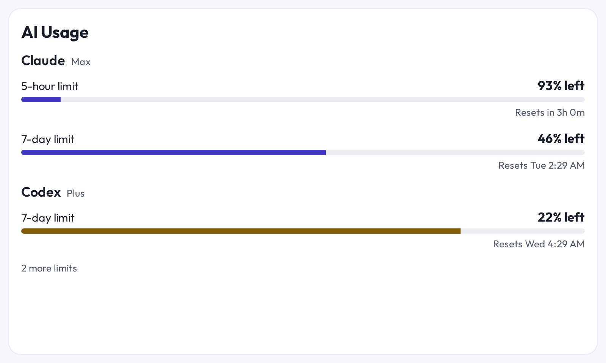
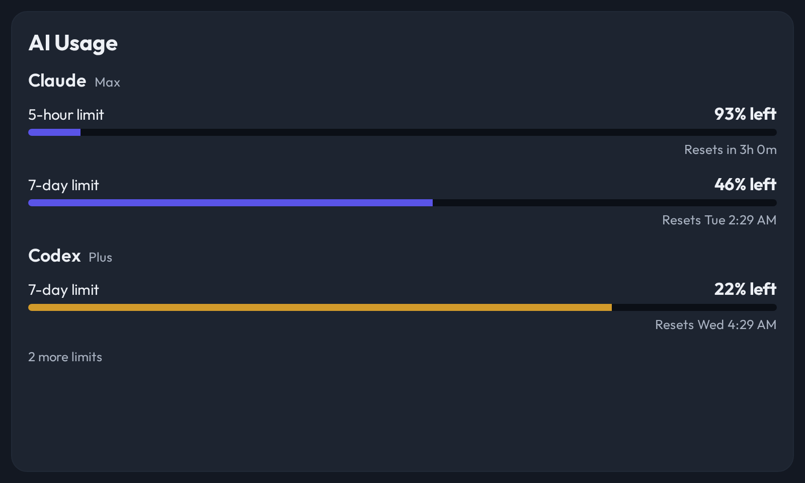
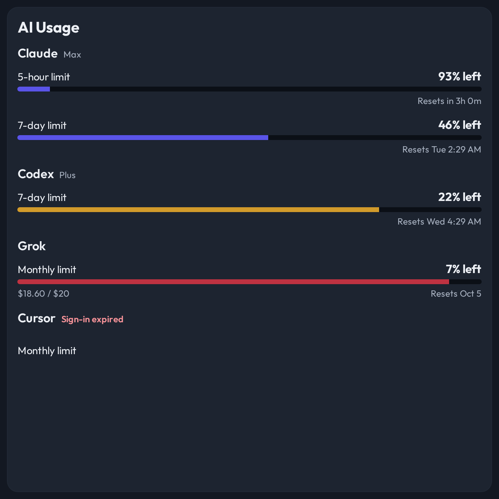
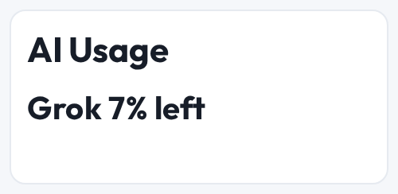

# AI Usage view

How much of each AI subscription is left, and when the next window resets. One
section per provider, one row per quota window.





## Where the data comes from

The **AI Usage** collector, over a channel of type `ai-usage.v1`. Provider credentials stay in that service. CastKit reads
only the normalized snapshot, so it holds no API key and opens no session with
Anthropic, OpenAI, xAI or Cursor.

Two adapters fill the channel. Pick one.

| Adapter | Use it when | Channel setting |
| --- | --- | --- |
| **MQTT** | The collector already publishes to your broker. | `topic` = `ai-usage/state` |
| **AI Usage** | There is no broker, or you prefer a direct read. | source `url` = the collector's base URL |

The MQTT adapter takes the producer's document unchanged; nothing has to be
republished in a CastKit-specific shape. The direct adapter polls
`GET /api/state` every 300 seconds by default, which is the collector's own
refresh rate — a faster poll reads the same answer back.

Both accept a `providerIds` channel setting. Leave it empty for every provider.

## The contract

```ts
{
  providers: [
    {
      id: "claude",
      name: "Claude",
      isOk: true,
      planText: "Max",          // optional
      problemText: "…",         // optional; why the provider is unreachable
      isCached: true,           // optional; a last-good answer during a backoff
      windows: [
        {
          id: "session_5h",
          label: "5-hour limit",
          percentUsed: 7,       // optional; absent means "not reported"
          resetsAtMs: 1764000000000,  // optional
          usedText: "$18.60 / $20",   // optional
        },
      ],
    },
  ],
  fetchedAtMs: 1763990000000,   // optional
  isMock: false,                // optional
}
```

## What the view decides

**The bar shows what is spent; the number says what is left.** A nearly full
bar and `7% left` are the same fact twice, and that is the point — the bar is
what the eye reads across the room, the number is what a person reads up close.
The wording follows AI Usage's own card so the panel and the web page never
disagree.

**A window at 75 percent turns the bar to the warning color, and 90 percent to
the danger color.** Nothing else on the row changes.

**A reset time is absolute unless two things are true.** The panel must repaint
faster than the value moves, which is the
[freshness rule](display-properties.md), and the reset must be less than a day
away. `Resets in 3h 0m` is useful; `Resets in 240h 0m` passes the freshness
rule on a live browser panel and still fails the reader. Beyond a day the view
says `Resets Tue 2:00 AM`, and beyond a week `Resets Oct 5`.

**Only rows that finish on the glass are drawn**, the same budget the
[agenda view](decisions/2026-09-14-an-agenda-view-draws-only-the-rows-that-finish-on-the-panel.md)
keeps. A provider joins the list only when its heading and at least one of its
windows both fit. Whatever was dropped is counted on the last line.



**A panel too short for one whole row still says something true.** It names the
window closest to spent, which is the one worth the glass.



**A provider CastKit cannot reach keeps its row** and says why. Dropping it
would make an outage look exactly like a healthy display.

## Decision record

[AI Usage is a native view on an `ai-usage.v1` channel](decisions/2026-09-25-ai-usage-is-a-native-view-on-an-ai-usage-v1-channel.md)
