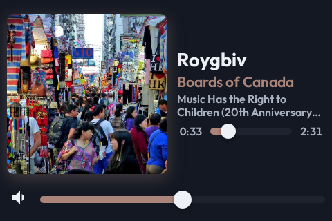
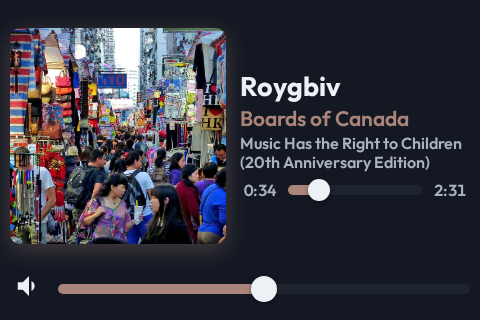

# The short panel's Now Playing art is 216px, and the album may take a third row

- **Status:** Accepted
- **Date:** 2026-09-12
- **Type:** UI / Layout
- **Supersedes:** the 232px art size set in
  [2026-09-11-a-short-landscape-panel-lays-the-clock-weather-and-calendar-out-beside-in-px.md](2026-09-11-a-short-landscape-panel-lays-the-clock-weather-and-calendar-out-beside-in-px.md)
  — its beside-in-px layout stands; only the art's edge changes
- **Superseded by:** —

## Decision

On a short landscape panel the Now Playing art is **216px**, not 232px, and the
album name may wrap to **three rows** when the measured block fits.

The art's edge is one declaration, `--art-size` on `.now-playing` inside the
short-panel media query. Every other number in that block is independent of it:
the text column is whatever is left, so changing the art is a one-number change
and never a layout rewrite.

The owner chose 216px from a rendered ladder and may revisit it. The ladder is
recorded below so the next reader does not have to build it again.

| Art | Text column | Change in art | Long album name | 31-character album name |
| --- | --- | --- | --- | --- |
| 232px (before) | 214px | — | 3 rows | 2 rows |
| **216px (chosen)** | **230px** | **−7 %** | **2 rows** | **1 row** |
| 208px | 238px | −10 % | 2 rows | 1 row |
| 200px | 246px | −14 % | 2 rows | 1 row |
| 190px | 256px | −18 % | 2 rows | 1 row |

216px is the smallest step that changes anything: it is where a 31-character
album name stops wrapping. Below it the column keeps growing but no line's row
count improves for either test name, so the extra width buys nothing the eye can
see and costs picture. 190px was rejected because the art starts to read as
small rather than as the view's anchor.

The third album row is separate and free. `fitTrackLines` only takes a budget
whose measured block fits, so the row is used when the height is spare and
dropped the moment the title needs it.

## Context

The 480x320 workbench panel gave the art 232px of a 320px-tall panel — 72 % of
the height. That left a 214px text column, and two things went wrong in it.

The album name was **clipped**. The row budgets in `trackLineFit.ts` capped the
album at two rows, and a 58-character name reached only "(20th Anniversary" on
the second row before the clamp cut it. Meanwhile the panel held **61px of empty
space** between the seek bar and the volume row, because the two `1fr` rows that
centre the text block on the art are equal and nothing was allowed to grow into
the lower one.

A 31-character name wrapped to two rows for no reason at all. It fits on one row
in any column of 230px or more.

The owner asked for either fix and said both would help:

> I want the music "now Playing" view on this super small 480x320 screen to have
> a slightly smaller thumbnail so the text has more space. It's pretty cramped. I
> like how big the thumbnail is, but having it just a bit smaller helps the text
> fit. That or let the album text go to 3 lines if there's vertical space
> available. That would _also_ help. I like how it looks now, but that thumbnail
> is enormous!

Both are in. They are independent, and each one alone removes the clipping.

## Why

**Two fixes, because they fail in different places.** The width fix helps every
line at every length. The third row only helps a name too long for two rows. A
name long enough to overflow three rows at 230px still exists, and then the
clamp is correct behaviour rather than a fault.

**216px over a bigger reduction, because the owner asked for "slightly".** He
also called the picture enormous, so the question was which of those two
statements bounded the other. The ladder answered it: the picture does not have
to shrink much to fix the text, so there is no reason to spend more of it.

**One declaration, because this is a taste call that will be revisited.** The
owner said so in the same breath as choosing the value. A layout that keys the
art, the grid column and the text width off three separate constants makes
"try 208" a three-file edit and a chance to leave two of them behind. The column
is derived, so it cannot drift from the art.

**A row budget is measured, never assumed.** `fitTrackLines` writes each
candidate and reads the element's own height back. Fonts fall back and line
heights differ by face, so a budget that "should" fit is not evidence. Adding
`[4, 3, 3]` at the top of the list is therefore safe by construction: any text
that fit before still fits, at counts no worse than before.

## Evidence

Measured in Chromium at 480x320, on the `Browser views/Now Playing` Workbench
story with fixture data, before and after:

| Measurement | Before | After |
| --- | --- | --- |
| Art | 232 x 232 | 216 x 216 |
| Text column | 214px | 230px |
| Album `Music Has the Right to Children` | 2 rows | 1 row |
| Album `…Children (20th Anniversary Edition)` | 2 rows, **clipped** | 2 rows, whole |
| Album row budget ceiling | 2 | 3 |
| Empty space below the seek bar, fixture album | 61px | 70px |

Before and after images are in the pull request and under `docs/images/`:

The 720x720 square is untouched. It does not match
`(min-aspect-ratio: 5 / 4) and (max-height: 400px)`, its art stays at
`52vmin` = 374.4px, and its row counts stay the stylesheet's own rather than the
fit pass's. `NowPlayingShortPanel.test.tsx` asserts all three.

Owner's quote, choosing the value and asking for this record:

> Let's do 216 for now. Document these variants. I might wanna look into it again

Chat: `df31c4cc-d3da-4813-8172-405ace7dbf0e`
