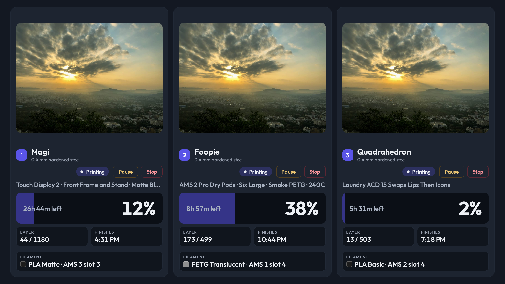
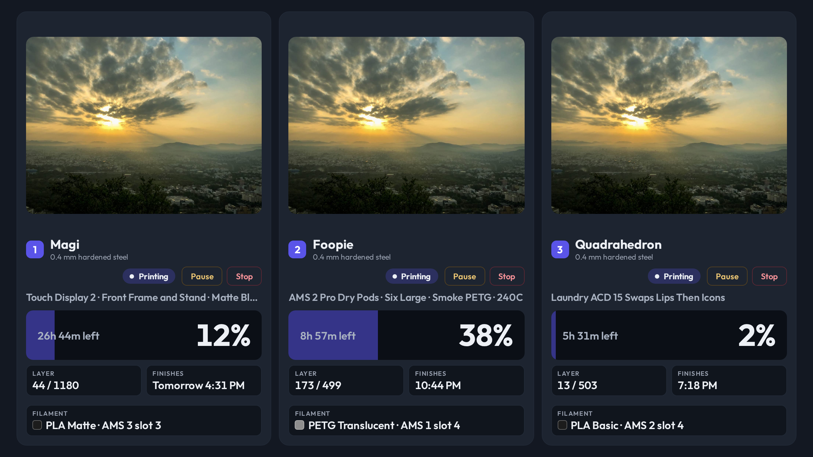

# A finish time names its day when it is not today

- **Status:** Accepted
- **Date:** 2026-09-25
- **Type:** View / formatting
- **Supersedes:** —
- **Superseded by:** —

## Decision

Printer Status prints `Finishes` with its day whenever the finish does not fall
on the day the panel is being read:

| Finish | Card |
| --- | --- |
| Later today | `3:47 PM` |
| The next day | `Tomorrow 3:47 PM` |
| Two to six days out | `Sun 3:47 PM` |
| A week or more out | `Aug 1 3:47 PM` |

The test is the **calendar day in the panel's own timezone**, not a twenty-four
hour window. The day is read back out of `Intl` against the server-stamped clock
config, never off the container's own `Date` getters.

A weekday stops naming a day once the name comes round again, which is why seven
days out gets a date instead. No print runs that long. A bad end time pushed by
an integration can still say it does, and the card must not answer `Fri` to a
date eight days away.

The words match BambuBuddy's own ETA (`formatETA`), which is where the same
finish is read everywhere else in the house.

## Context

The Basement 3D Printers Workbench Display carries Printer Status beside the
machines. The `Finishes` metric printed a bare clock time.

The owner read the Magi card on 2026-09-25 and reported it: the card said the
job finished in the afternoon, and the job finished the next day.

A twenty-four hour rule was the first ask. It is not the rule that fixes this,
because the ambiguity is a midnight and not a duration. A print ending at 01:00
is eight hours away and is still not today, and a bare `1:00 AM` misreads there
in exactly the same way. A print that starts at 02:00 and ends at 23:00 is
nearly a day long and needs no prefix at all.

## Why

A time with no date states a day, and the day it states is today. On a panel
whose whole subject is machines that run for more than a day, that is the one
reading the card could not afford to leave to the reader.

The band already says `26h 44m left` two lines above. The two facts disagreed —
one said more than a day, the other said this afternoon — and the absolute one
is the one a person plans against.

`Intl` rather than `Date`: the panel's timezone is the one on the wall, and a
kiosk container's clock is not always it. The rest of this view's formatting
already honors the server-stamped clock config, so the day boundary does too.

## Evidence

The owner, 2026-09-25: *"Kiosk says a print job finishes at 3-4p today on Magi.
But it finishes tomorrow! Can we add a date if it's more than 24h?"*

Before and after, the workbench panel at 1280x720 on fixture data, three cards,
the first with 26h 44m left:

The longer string fits the narrowest case. Three cards is where the metric block
is smallest, and `Tomorrow 4:31 PM` sits inside it with room left.
