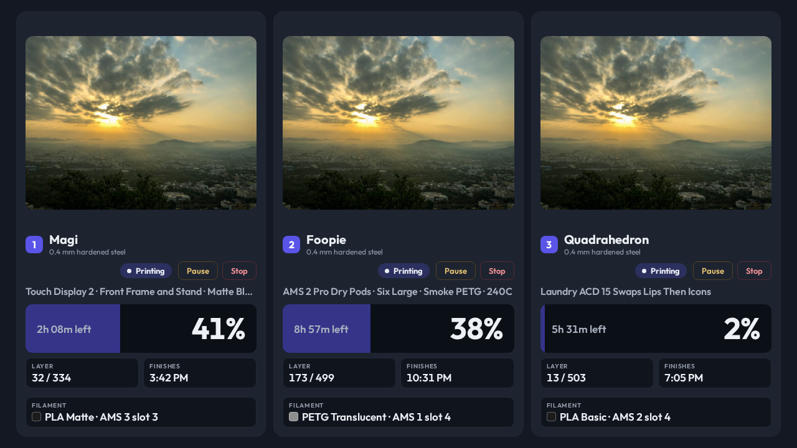
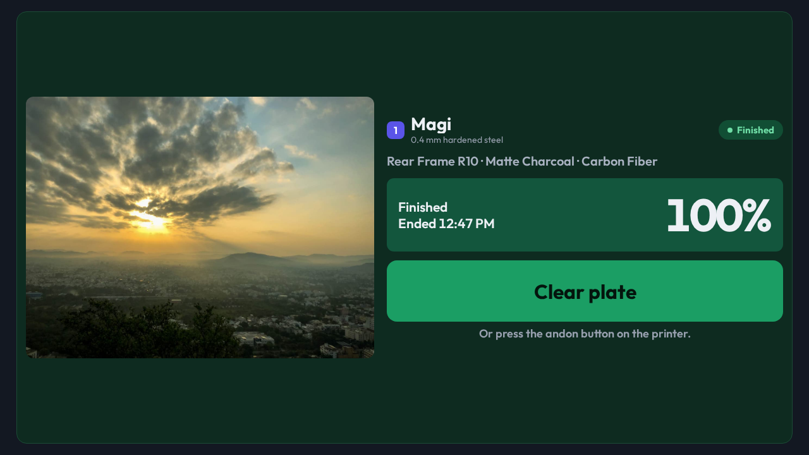
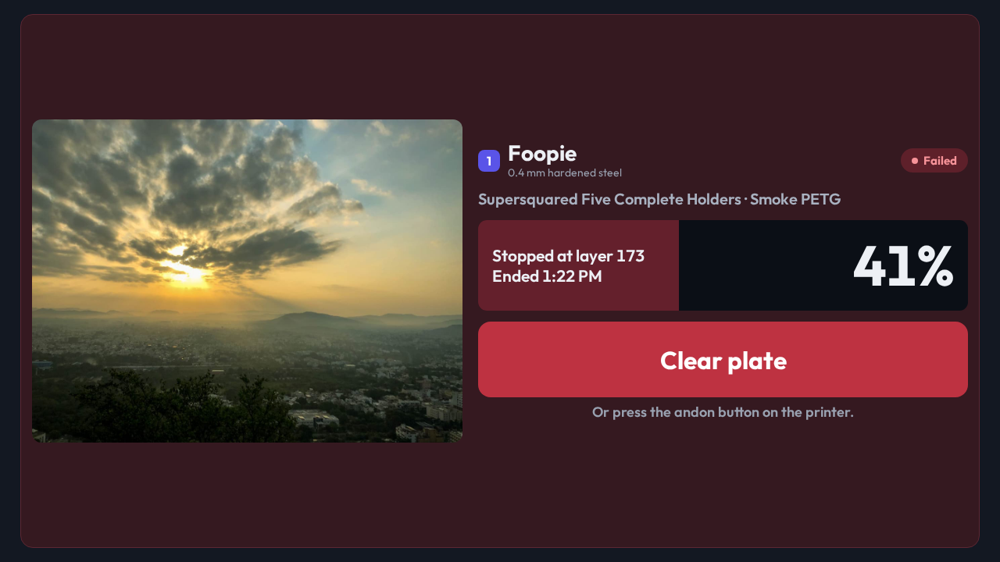
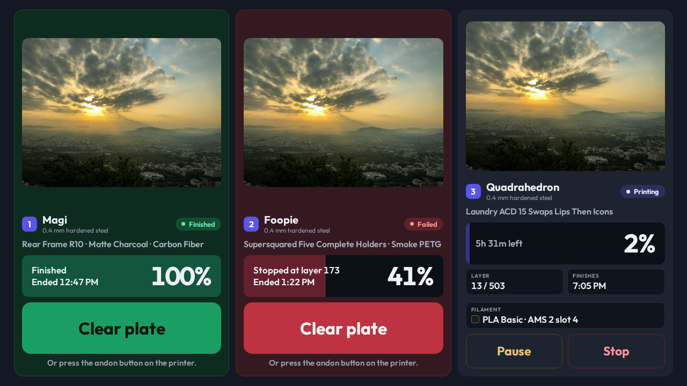

# A finished print stays on the glass until the plate is cleared

- **Status:** Accepted
- **Date:** 2026-09-28
- **Type:** View / behavior
- **Supersedes:** [The print state is a chip beside the controls](2026-09-24-the-print-state-is-a-chip-beside-the-controls.md), for the placement of Pause and Stop only. The chip in the head, its dot, and its intent-driven color all stand.
- **Superseded by:** —

## Decision

Printer Status keeps a `finished` or `failed` job on the glass until the plate is
cleared. Home Assistant pushes such a job like any active one; the card does not
leave when the print stops, it leaves when the next `printers` push no longer
carries it.

A settled card is colored by its state across the WHOLE card: finished takes the
success tokens, failed takes the danger tokens. Its band reads `100%` on a
finished print and the percentage reached on a failed one, with how it ended at
the band's left — `Finished` or `Stopped at layer 173`, and `Ended 3:47 PM`
under it when the payload carries `finishAt`. The metric row and the Pause/Stop
pair go.

In their place, a full-width **`Clear plate`** button with the sentence
`Or press the andon button on the printer.` under it. One tap, no confirmation:
it publishes `printer_clear_plate` with the printer's id, the button reads
`Clearing…`, and the card waits for the job to leave the payload. If the job is
still there after ten seconds the label lapses and the button is live again.

Pause, Resume and Stop move from the head to the **foot of an active card**,
full width and split evenly, sized for a fingertip: `max(48px, 8.9vmin)` tall,
which is 64 px on the 1280x720 workbench panel and scales down in proportion on
the smaller profiles with a 48 px floor. `Clear plate` is `max(56px, 13.4vmin)`,
96 px on the same panel.

Home Assistant maps `printer_clear_plate` onto BambuBuddy's clear-plate call —
the same call the printer's own andon button makes. After the clear, the panel
shows whatever Home Assistant makes active next; HA is always in charge of the
active screen, and CastKit does not switch views on its own.

## Context

The view showed a printer only while it was `preparing`, `printing` or
`paused`. A print that finished left the glass the moment its status changed,
and so did a print that failed. The panel stands beside the machines: the
person who started the print is often not the person walking past when it
ends, and a plate that nobody clears blocks the next job in BambuBuddy's queue.

The Filament Spool Scale work (`spools.v1`) added `finished` and `failed` to
`PRINTER_JOB_STATES`, the `printer_clear_plate` command, and
`clearPrinterPlate(printerId)` in the client state. This record is the view
that uses them.

The mockup for the look was served with the Spool view round and approved:
the finished and failed cards tinted whole, the solid full-width button, the
andon sentence under it, and Pause/Stop shown at the same larger size at the
foot of the running card.

## Why

- **The card is the reminder.** A chip in the head cannot be read from across
  the room. A green card can, and a red one can be read as a fault.
- **One tap, no question.** Pause and Stop ask first because a wrong tap loses
  a print. Clearing a plate loses nothing — the print has already stopped — and
  the printer's own andon button does the same with one press. A question
  here would be friction on a control whose whole purpose is to be easy.
- **The andon sentence is not decoration.** The owner's words: the screen
  shows a way to clear the plate, *or* the button on the printer does. The
  panel is one of two places to do it, and it says so.
- **The controls move to the foot.** A 64 px button does not fit in a head
  beside a name at three columns. The chip stays where the 2026-09-24 decision
  put it, in the head; only the buttons leave, and they leave for the size.
- **Pending lapses on its own.** The job leaving the payload is the real
  confirmation. Ten seconds with the job still there means the request did not
  land, and a dead button on a wall panel is worse than a second tap.
- **CastKit does not switch the view.** The panel returns to whatever Home
  Assistant makes active. That is the standing split: CastKit owns every
  control, HA is the automation surface and the only thing that chooses the
  screen.

## Evidence

Owner, T3 Code chat `a86efc56-0324-449a-bdf7-b936102abb20`, 2026-09-28:

> It keeps the current print job shown on the screen until you clear the
> plate, and the screen will show a way to do that or you could press the
> andon button. That way, you don't accidentally forget.

Before, the three-printer workbench panel with Pause and Stop in the head:

After, on fixture data at 1280x720:

`PrinterStatus.test.tsx` asserts the state labels, the card's `data-intent`
by state, that `Clear plate` publishes `printer_clear_plate` with the
printer's id, that a finished card offers no Pause or Stop, and that the
pending label lapses. `printerStatusTouchTargets.test.tsx` measures the
button heights at every panel profile.
