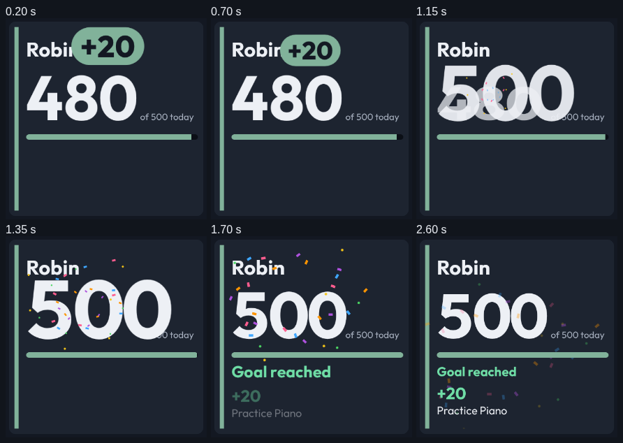
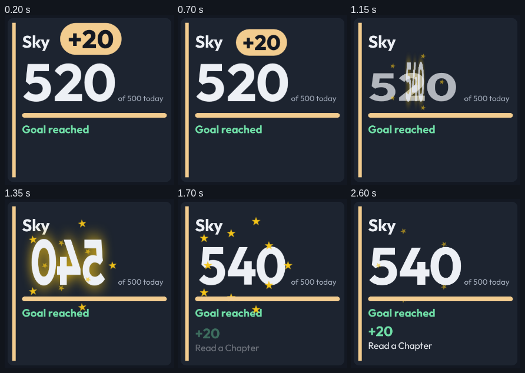

# A scan reaches every display in its room, and only an instant display animates it

- **Status:** Accepted
- **Date:** 2026-09-29
- **Type:** Platform / view behavior
- **Supersedes:** item 4 of [Kids Points is a native view on a `kids-points.v1` channel](2026-09-29-kids-points-is-a-native-view-on-a-kids-points-v1-channel.md) (a `slow` panel never showing a scan); its item 5 is extended from a room's screen to a room's displays
- **Superseded by:** —

## Decision

1. **Any physical display takes a temporary view**, whether or not it is on a
   platform screen: `<base>/<device-id>/override/set` with
   `{"viewId","durationSeconds","priority"}`, or
   `POST /api/manage/platform/devices/<device-id>/show`. The highest priority
   wins, a more recent request wins a tie, and the display returns to its
   assigned screen or its own view system when the last one expires. It is not
   saved. A screen override is unchanged and still needs a screen.
2. **The display sets the length, by the freshness rule.** A temporary view is
   a value whose lifetime is the time it stays up, so it lasts at least ten
   repaints (`getTemporaryViewSeconds`): `instant` and `fast` keep the requested
   time, `slow` lengthens fifteen seconds to thirty, and `super-slow` refuses.
   The Kids Points scan window uses the same function, so the view and the
   override end together.
3. **A room's automation sends the view to every display in the room** and
   lets each display accept or refuse. CastKit still has no room model; Home
   Assistant's areas are the rooms.
4. **Only an `instant` display animates a scan.** A scan that earned points
   drops a `+N` chip into the old total, the two squash together, the new total
   bounces in, and the goal bar grows. Reaching the goal throws confetti; a scan
   after the goal flips the total with a gold glow inside a ring of stars. A
   `fast` or `slow` display draws the same result still: the points earned,
   the task, and the new total. A scan that earned nothing does not move.
5. **Every motion element rests at the end of its motion**, so a panel with
   motion switched off, by the blanket `data-repaint` rule or by
   `prefers-reduced-motion`, shows the final total and never a half-played
   frame. The confetti and stars are a fixed golden-angle pattern, not random.

## Context

The first Kids Points release showed a scan on the five room **browser**
screens only, through a screen override. A physical display could not show it:
none is on a platform screen, and assigning one replaces its whole view list.
The owner asked for the scan on any `slow`, `fast` or `instant` display in the
room, with motion where the display can play it.

A `slow` display could not show the scan at all, because a fifteen-second
result fails the ten-repaint rule on a three-second panel. Lengthening the
window to ten repaints keeps the rule and gives the owner the still result
that was asked for.

## Why

- **A device override is the screen override one level down.** It reuses the
  platform page, the image scheduler and the socket check through one
  `getDeviceTarget`, so an image display, a browser display and an assigned
  display all follow the same rule.
- **Refusing on `super-slow` is the freshness rule, not a special case.** A
  28-second full-flash panel would spend most of a minute showing the scan and
  taking it away, and the scan would be over before either frame finished.
- **Lengthening instead of refusing on `slow`** is what the owner asked for:
  "displaying the points received for the scan and total points is enough."
- **Motion only on `instant`** is the existing display-properties rule. The
  owner reached the same conclusion for `fast`: it is "streaming images, not
  playing encoded video."

## Evidence

> "When a kid scans a card in a room with a CastKit 'slow', 'fast', or
> 'instant' display, it should show the view we set up. If it's a device we
> can animate, it'd be good to show some animation on the points changing. If
> it's 'slow', displaying the points received for the scan and total points is
> enough."

> "For 'instant' devices, we could animate it where it shows the old value, the
> new value going into the old value and merging with it, then it shows the new
> score. This can be a bouncy animation. At the 'goal' scan (400 or 500 points
> depending), it can show confetti. Not sure about the post-goal scans.
> Something fun for those too."

> "That might not be possible for 'fast' devices as we're streaming images, not
> playing encoded video or anything, so it's probably just like the 'slow'
> displays in that it shows the points scanned and the final value."

— maintainer, chat 47ad405f-72af-4a77-b9bd-9ab5e36f14dc (2026-09-29)
