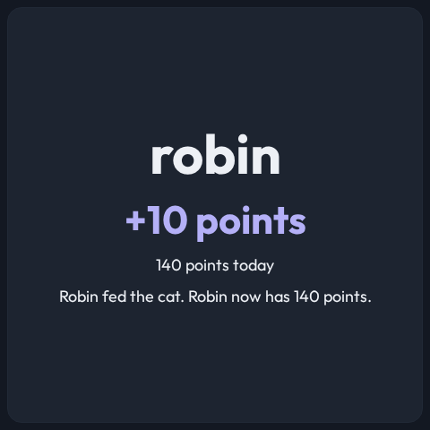

# Kids Points is a native view on a `kids-points.v1` channel

- **Status:** Accepted
- **Date:** 2026-09-29
- **Type:** View / data source
- **Supersedes:** —
- **Superseded by:** —

## Decision

1. **Kids Points is a native view on a new `kids-points.v1` channel**: every
   child's points today against the goal, plus the last card scan. The single-
   result `points.v1` view stays for any producer that sends one result.
2. **A `kids-points` adapter reads the points service over MQTT directly** —
   a wildcard state topic (`points/state/+`, one retained document per child)
   and a scan result topic (`points/resp/scan`). CastKit never awards points and
   holds no rule of the points service.
3. **The view chooses its shape from its own box.** A panel that fits every
   child side by side at 220 x 200 px per card draws a board, and a scan
   outlines that child and dims the rest. A smaller panel draws rows, and a
   scan there gives the whole panel to the child who scanned.
4. **A scan is shown for `scanSeconds` (default 15), and only on a panel whose
   repaint passes the freshness rule for that window.** A `slow` or
   `super-slow` panel shows the totals and never a scan result.
5. **The room stays the house's knowledge.** A channel's `readers` setting
   limits which readers' scans it shows; the automation that knows which room a
   reader is in sends the room's screen a temporary override. CastKit gains no
   room model.
6. **A child's identity color is a stripe and a bar fill, never text.**

## Context

The owner asked for a Kids Points view: when a child scans a card in a room
with a display, the display shows that child's points, and a larger display
shows every child's points. A room feedback path already existed — a Home
Assistant automation republishing each scan result as a `points.v1` message to
a per-room channel, and a fifteen-second screen override — but `points.v1`
holds one person, so it could not show the family, and the per-room republish
carried only one child's number.

## Why

- **The producer already publishes everything the board needs.** Every child's
  retained state and every scan result are on the broker; a second copy
  assembled in an automation would be one more place for the numbers to drift.
- **A contract of its own, not a widened `points.v1`.** `points.v1` requires a
  name and a single total; a list of children with a separate last scan is a
  different shape, and a producer of the old one must keep working.
- **The shape follows the panel, not a setting.** "Larger" is a property of the
  box the view is given, which also covers a split layout on a large display.
- **The freshness rule already answers the slow panel.** A fifteen-second
  result drawn by a panel that takes 28 seconds to repaint appears after it
  has ended. The totals it changed live until the next scan.
- **The reader filter is a channel setting because the view has no idea where
  it is.** The same view definition serves a room screen and an always-on
  board; only the channel differs.

## Evidence

Owner, T3 Code chat `47ad405f-72af-4a77-b9bd-9ab5e36f14dc`, 2026-09-29:

> I want to add the view so when you scan a card in a room with a display, it
> shows the points for that kid on the screen and also shows multiple kids'
> points on larger screens.

Screenshots from fixture data: [the view's reference](../kids-points-view.md).
