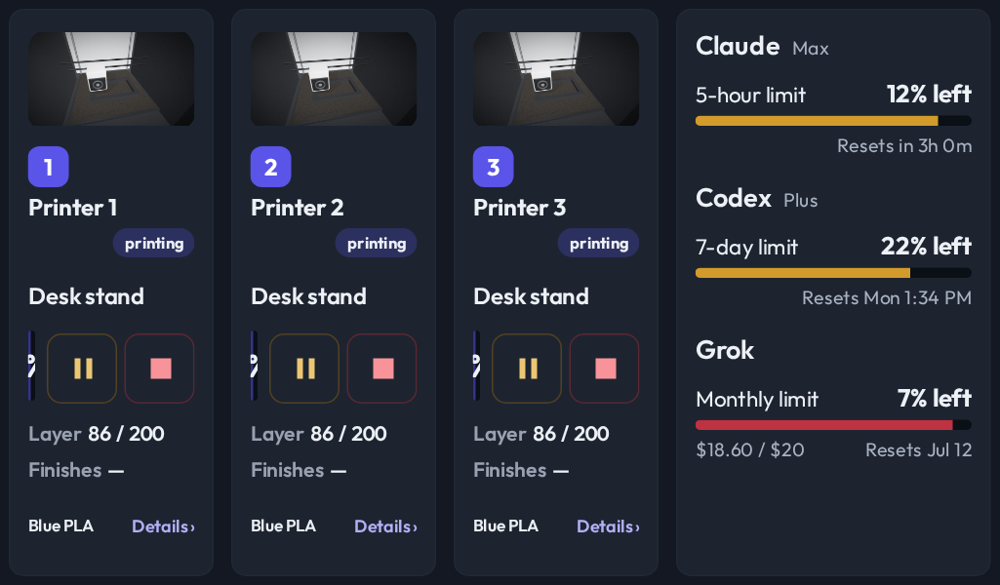
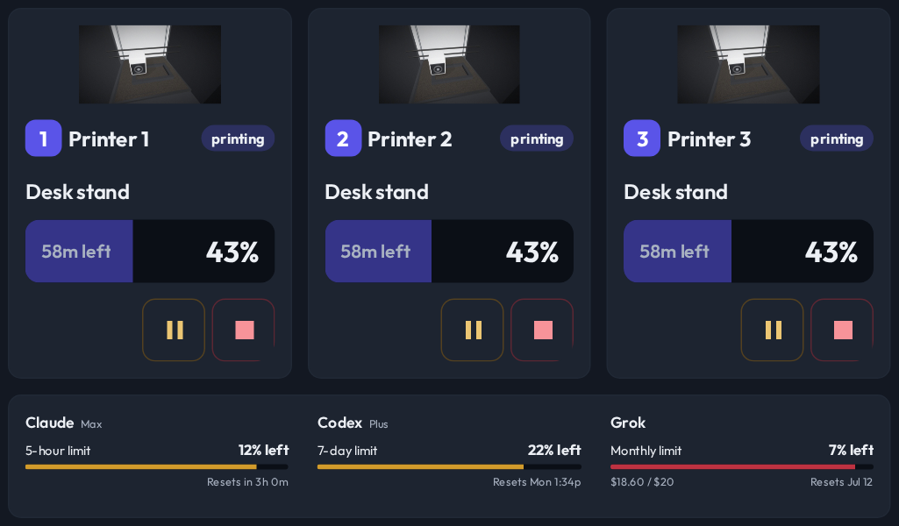

# Optional details hide before printer cameras and controls

- **Status:** Accepted
- **Date:** 2026-10-02
- **Type:** View layout policy
- **Supersedes:** —
- **Superseded by:** —

## Decision

Focus priority controls how additional space is spent. Visibility priority
separately controls what may disappear and its minimum usable dimensions.
Printer cards drop filament first, then layer and finish metrics, then media.
Printer identity, progress and remaining time, controls, problems and control
availability remain required. Measurements use the actual styled facts and
available space, including scaling, rather than calendar or screen-size guesses.

Camera candidates require at least 100px width and 56px height, adjusted for
their aspect ratio so a contained image remains usable. Facts measure at their
candidate width. Narrow progress rows can put controls on their own line.
Low-priority adaptive AI usage can shrink to scale 0.65; ordinary standalone
usage retains its existing scale floor. Its budget matches the drawn type.

Native Rip Deck views keep every active job. Poster grids require whole cards
at least 140px wide and 180px tall, and fall back to rows when they cannot fit.
Rows can retain a 44px-wide poster with at least 64px of image height and
240px of remaining facts width. Otherwise posters disappear. One to three
jobs can keep artwork at 480 by 320; dense jobs keep their status rows.
This does not change the live tower installation's renderer or assignment.

## Context

At 1024 by 600 with 150 percent scaling, a composition clipped progress and
controls while keeping a large AI usage panel. Less useful details need to
yield before the information needed to monitor and control a print.

## Why

Focus and retention are different requirements. Layouts must draw required
content completely while allowing optional details to return when space grows.
The policy is implemented in Charcuterie's shared measured-layout selector.

## Evidence

User, 2026-10-02: “this can be hidden if we have no space”
User: “even less important is the filament in use. That can be removed if we don't have enough, then the layers and the finish time.”
User: “the AI usage numbers can shrink a lot and still be readable.”

Chat: T3 Code thread associated with branch fix/layout-visibility
(chat ID unavailable).

At an effective 683 by 400 viewport (approximately 1024 by 600 at 150 percent):

These use invented public fixtures. Browser regressions assert whole progress,
controls and cameras at 1024 by 600 and 683 by 400.
