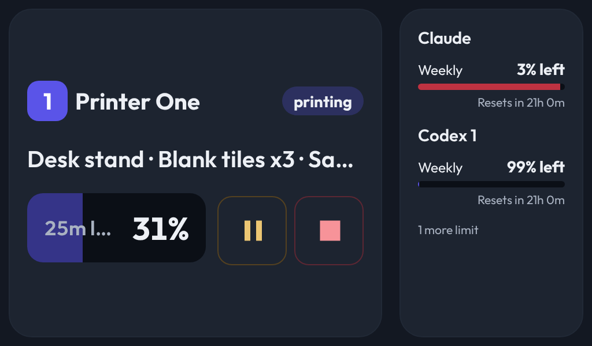
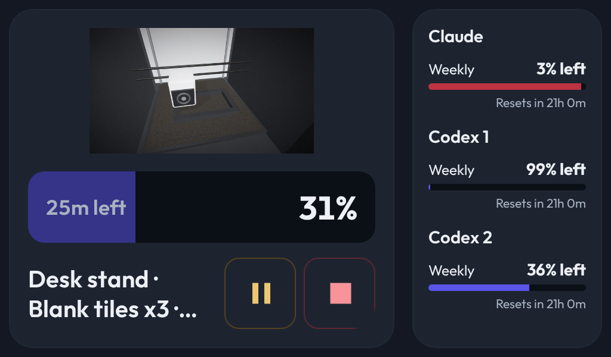

# Progress and fullest subscriptions survive tight layouts

- **Status:** Accepted
- **Date:** 2026-10-03
- **Type:** Display content priority
- **Supersedes:** [Required printer identity in tight layouts](2026-10-02-optional-details-hide-before-printer-cameras-and-controls.md), only the requirement to retain the visible heading
- **Superseded by:** —

## Decision

On a printer facts column no wider than 320 CSS pixels, remove the printer
heading. Give percentage and remaining time the full first row. Put the model
name, limited to two lines, beside controls on the second row. Keep the printer
identity available to assistive technology and in the action confirmation.
Progress and remaining time take priority over the model name. Cameras and
controls retain their existing usability floors.

AI Usage first fits all selected subscriptions by shrinking the type within its
existing adaptive floor. A narrow single column may use its allocated width
rather than falling back to larger text merely because it cannot meet the
preferred column width. When some limits still cannot fit, retain the highest
reported percentage used first. Preserve configured ordering when every limit
fits; unknown usage sorts below reported usage when hiding is necessary.

Measure printer facts in CSS pixels, matching the layout's client dimensions,
including when the page is zoomed.

## Context

A highly scaled 1024 by 600 composition clipped remaining time while retaining
a large printer heading and model name. A narrow usage rail fell back to larger
text and omitted a more heavily used subscription despite room for compact rows.

## Why

The panel must answer how far the print has progressed and how long it has left.
A nearly exhausted subscription needs closer monitoring than a mostly empty one.

## Evidence

User: “the percentage and time remaining are higher priority than the name of
hte model. I don't care about that.”
User: “Put the controls and model name on 2 lines when you have no space like
this and remove the title.”
User: “you should prioritize the ones that are the most full”.

Chat: T3 Code thread associated with workspace branch `t3code-3ed22b5d`
(chat UUID unavailable).

Public fixture captures at 1024 by 600 with 2.5 scale:

Browser regressions also check 1.5 scale, complete camera/control bounds,
readable remaining time, non-overlapping model/controls, and all three accounts.
