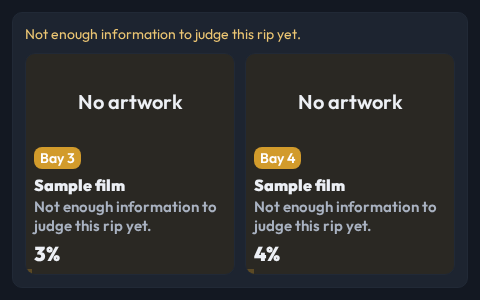
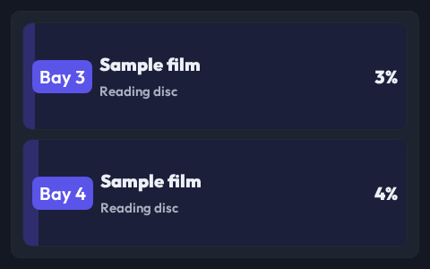

# Rip panels show status without metadata warnings

- **Status:** Accepted
- **Date:** 2026-10-03
- **Type:** Display content priority
- **Supersedes:** —
- **Superseded by:** —

## Decision

CastKit does not show missing artwork placeholders or reserve artwork space for
bays without a poster. When no focused bay has artwork, a poster request falls
back to status rows.

Rip Deck's `unknown`, `ok`, and `disc_marginal_slow` verdicts are not problems.
The source adapter omits their messages from per-bay problems and tower alerts.
A bay then shows its actual rip phase or state, with progress. Real read errors,
USB problems, stalled jobs, and quarantine reasons retain their warnings.

## Context

A compact combined display showed “No artwork” and repeated “Not enough
information to judge this rip yet.” above and inside otherwise normal rip cards.
The upstream Rip Deck UI already distinguishes an unmeasured verdict from a
problem; CastKit was treating every alert payload as a warning.

## Why

Missing optional metadata says nothing useful about the rip. Display space
belongs to progress and status, while warnings must describe actual trouble.

## Evidence

User: “\"no artwork\" is not helpful. We don't have much screen real estate”.
User: “they're showing warnings when nothing's wrong.”

Chat: T3 Code thread associated with workspace branch `t3code-3ed22b5d`
(chat UUID unavailable).

The source regression preserves read-error and USB alerts, plus quarantine
reasons, while dropping neutral verdicts. The browser regression checks phase
text, absent artwork placeholders, and distinct healthy/troubled warning states.

