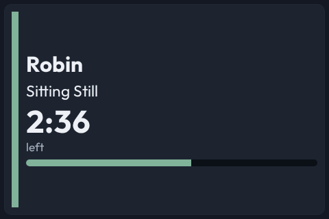
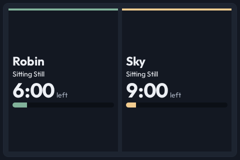
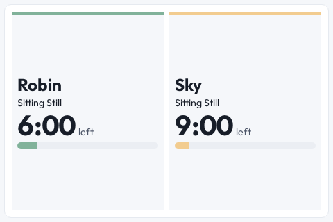

# Kids Points shows simultaneous countdowns

- **Status:** Accepted
- **Date:** 2026-10-06
- **Type:** Display behavior
- **Supersedes:** —
- **Superseded by:** —

## Decision

Kids Points shows simultaneous countdowns for multiple children. A compact panel gives each running countdown its own cell. Larger boards keep each running child's countdown visible without dimming that child. Stopping or completing one timer leaves the other active until its own deadline.

The source keeps accepted timer scans separately from the latest feedback scan, per channel. Reader filters still decide which starts belong to a room. Countdown metrics come from each saved session's start and target. Slow panels show absolute deadlines.

## Context

The latest scan previously selected one countdown on compact panels and controlled whether an active-only view remained visible. Starting a second child hid the first; stopping the second also lost the first's active status.

## Why

Independent sessions need independent display lifetimes. Keeping accepted scans per child preserves room filtering without making the last scan the only timer.

## Evidence

Owner, current T3 Code conversation, 2026-10-06 (chat ID unavailable):

> CastKit should be able to show 2 timers

SDK, source, browser and visual capture coverage verifies independent countdowns, room filtering, cancellation and slow-panel deadlines.

Fixture captures on a 480 by 320 panel:

