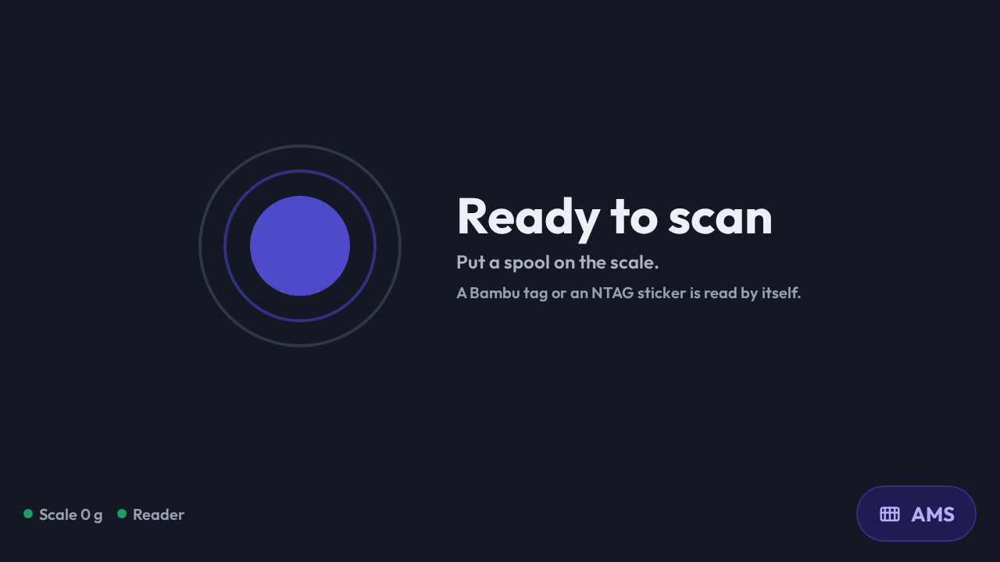
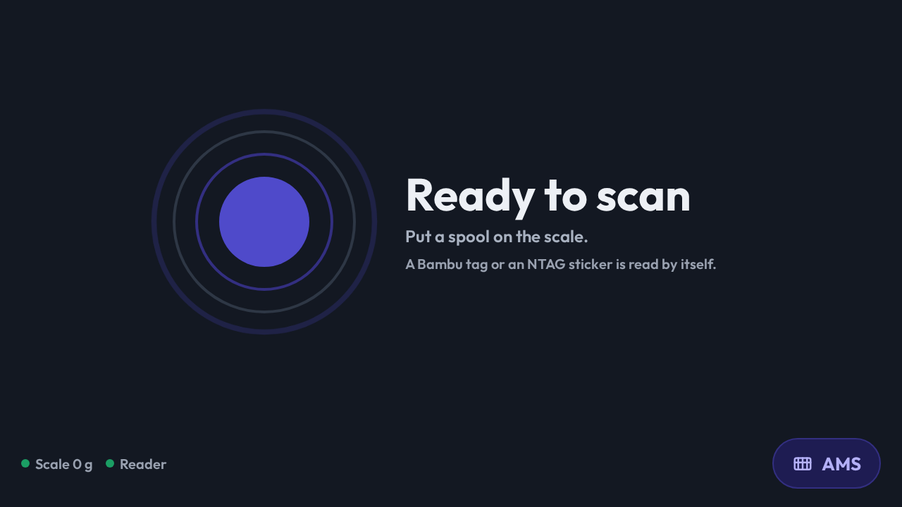
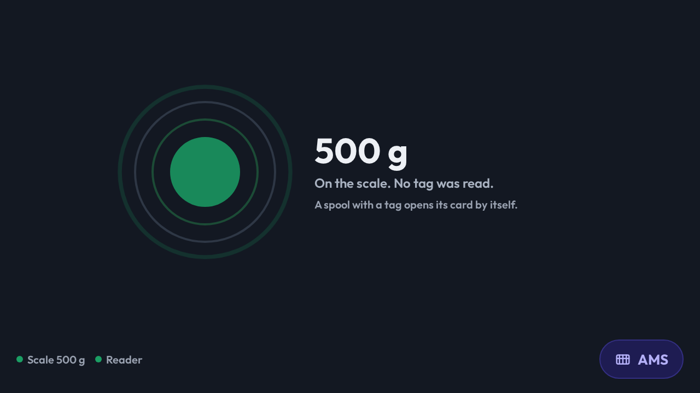
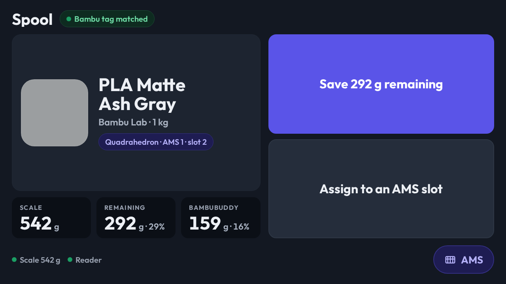
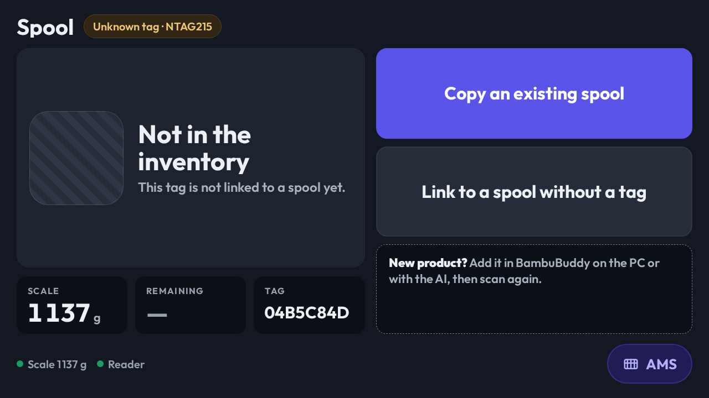
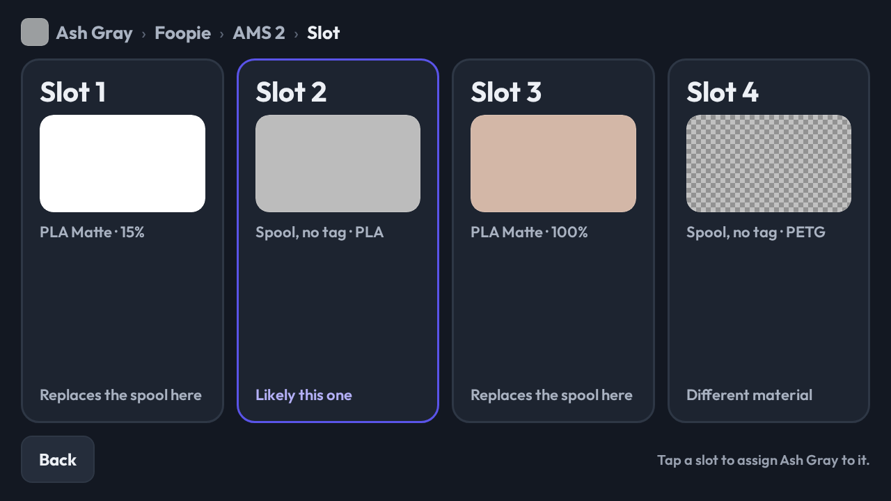

# Filament Spool Scale view

A native CastKit view for the panel that stands over the filament scale: the
Raspberry Pi Touch Display 2, 1280×720, read at arm's length with a spool in
the other hand. It answers three questions in three taps or fewer — what is
this spool, how much is left on it, and which AMS slot is it going into — and
shows every AMS slot in the house at a glance.

Its data is the `spools.v1` channel ([contracts](../packages/sdk/src/contracts.ts)).
The channel keeps two facts apart on purpose: what the **scale reads now**, and
what the dashboard has **on record** for the spool. The view prints both, side
by side, and the Save button is what closes the gap.

## The screens

The data decides which screen the reader shows. Nothing in the view is a mode a
person has to leave; a tag arriving or leaving moves the panel by itself.

| Reader state | Screen |
| --- | --- |
| `tag.state: none` | **Ready to scan.** The ring, the prompt, the scale's live reading in the corner. Two waves grow out of the ring's center and fade, every 3.5 s, in the accent color — the reader is listening. An offline scale stills them. |
| `tag.state: none`, scale at 5 g or more | **Weighing.** Something is on the scale and no tag was read — a spool with its sticker turned away, or a calibration weight. The title becomes the reading (`500 g`) and the ring turns the success color. It pings every 1.2 s while the reading settles and goes back to the slow beat once `isStable`. Under 5 g is scale creep and stays Ready to scan. |
| `tag.state: matched` | **The spool card.** Swatch, product and color name, brand and label weight, where it is loaded if it is, and three facts: the scale, what that leaves on the spool, and what the record says. One primary button: `Save NNN g remaining`. |
| `tag.state: unknown` | **Not in the inventory.** The tag's uid, two actions — copy an existing spool onto the tag, or link the tag to a spool that has none — and a plain note about adding a new product. |
| no `spools` data yet | **Waiting for the scale.** The view has not heard from the reader. |

`matched` with a `spoolId` the inventory does not list is treated as `unknown`.
The reader knew the tag once; the inventory does not know it now.

The **AMS** pill in the bottom-right corner flips to the other side of the
view: every unit of one printer, chosen by the tabs across the top, with each
slot in one of three states. The pill then reads **Spool** and flips back.

### The three facts

| Fact | Where it comes from |
| --- | --- |
| **Scale** | `scale.grams`, the live reading. |
| **Remaining** | `scale.grams − coreWeightGrams`, never below zero, and its share of `labelWeightGrams`. What the scale says is left. |
| **BambuBuddy** | `remainingGrams`, the record's own count, and its share of the label weight. |

A gap between the second and the third is the reason the button exists.

### Saving

`Save NNN g remaining` names the net grams and sends **the scale's reading**,
not the net: the dashboard's own update endpoint takes the reading and
subtracts the core itself, so sending the net would subtract it twice.

```json
{ "action": "spool_save_weight", "value": "<spoolId>", "payload": { "grams": 542 } }
```

The button then reads `Saving…` until the next `spools` push carries a new
`lastScaleGrams` for that spool, at which point it reads `Saved NNN g
remaining` for four seconds. A save the dashboard silently dropped becomes live
again after fifteen seconds rather than staying stuck. The label follows the
scale live: lift the spool and it drops to `Save 0 g remaining`.

The button is disabled while the scale is offline, and says so.

### Assigning a spool to a slot

`Assign to an AMS slot` walks the matched spool to a slot in three taps, one
screen per step, each a row of cards the size of a hand:

1. **Printer.** One card per printer: how many units it has, how many unread
   spools and empty slots. The foot of the card says `Has room`, `Every slot is
   read`, `Offline` (and the card cannot be tapped), or where this spool is
   already loaded on that printer.
2. **AMS.** One card per unit, with its humidity and four small swatches for
   what each slot holds. An unread spool's swatch is outlined in the accent; an
   empty slot is a dashed box.
3. **Slot.** One card per slot with a large swatch. The foot says `Likely this
   one` for an unread spool of the same material — the AMS can see a spool
   there and cannot say which, and the spool on the scale most likely came off
   that slot — `Replaces the spool here` for a read spool, `Different material`
   when the materials disagree, and `Free` for an empty slot.

The crumbs across the top name the spool and the step. `Back` undoes one tap;
on the first step it is `Cancel`. Tapping a slot sends the command and returns
to the spool card. There is no second confirmation: a wrong slot is undone by
assigning again.

```json
{ "action": "spool_assign_slot", "value": "<spoolId>", "payload": { "printerId": "foopie", "amsId": 1, "trayId": 1 } }
```

`amsId` and `trayId` are the channel's own ids, zero-based; the cards print
them one-based (`AMS 2`, `Slot 2`), and a unit's printed name is its `label`.

### Copying and linking a tag

An unknown tag offers two ways in:

- **Copy an existing spool** opens the whole inventory as a grid of tiles —
  swatch, product, color, brand and core weight — with a chip per brand to
  narrow it. Tapping a tile makes a new spool from that product and puts this
  tag on it: `spool_copy_to_tag`.
- **Link to a spool without a tag** opens the same grid filtered to spools
  with no `tagUid`, showing what is left on each. Tapping one puts this tag on
  that spool: `spool_link_tag`.

Both carry the tag's facts from the channel in the payload: `tagUid`, and
`tagType` and `trayUuid` when the reader supplied them. The picker closes by
itself when the tag leaves the reader.

The note under the buttons is prose, not a control. A product the inventory
has never seen is added on the PC or through the AI, and the next scan of the
tag lands in this picker with it in the list.

### The AMS view

One printer at a time, chosen by the tabs. Each unit is a card with its label,
its humidity, and one row per slot:

| Tray state | Row |
| --- | --- |
| `read` | Swatch, product, a remaining bar and the percentage. At or below 10 % the row is outlined in the warning color. |
| `untagged` | Swatch, `Spool, no tag`, the material, outlined in the accent with a `?` where the percentage would be. |
| `empty` | A dashed box that says `Empty`. |

Chips beside the tabs count the chosen printer's low slots and unread spools.
An offline printer's tab and units draw dimmed: the trays it reports are the
last it saw, not the ones it has.

While a matched spool is on the reader, every slot row is a button: tapping
one assigns the spool there in one tap and returns to the spool card. With
nothing on the reader a row is a fact, not a control.

## Swatches

A swatch is drawn from the spool record and nothing else:

- `rgba` with an alpha below `FF` is **translucent**: the color is painted at
  its own alpha over a checkerboard.
- `extraColors` makes a **two- or three-color** swatch: the colors are clipped
  vertical bands inside the rounded box, never a gradient, which would bleed
  under the box's translucent border and read as a smudge at this size.
- `effectType` containing `galaxy` draws specks, `marble` draws veins, `silk`
  draws a sheen. Any other effect draws the plain color.

An unknown tag's placeholder is diagonal hatching with no color.

## Status

The bottom-left corner always names the scale and the reader with a dot each.
The scale's dot turns red and the reading is replaced by `Scale offline` when
`scale.isOnline` is false; a stale number beside a red dot would still be read
as a weight.

## Layout

The view is sized in pixels for the 1280×720 panel and no other. Every type
size, gap and card size was tuned on that panel across three review rounds of
the mockup, and a scale with a reader is not going to be installed under any
other panel in the fleet. Text fits its box or ends in an ellipsis; nothing
overflows sideways.

The screen a person is on is local to the panel — a module signal, not
component state — so a Storybook story can open the view on any screen
without a play function driving the taps. The server holds no opinion on
which screen is up.

## Previews

`Views/Filament Spool Scale` in the browser Storybook carries one story per
panel plus every state at the 1280×720 profile: ready, weighing with no tag
(settled and settling), matched (plain,
translucent, galaxy, two-color), unknown, both pickers, each assign step, the
AMS view online and with an offline printer, the scale offline, and the wait
before the first push. All fixture data is invented; nothing in it is the
household's inventory.








