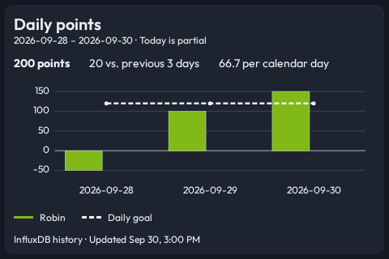
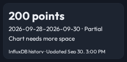

# Points history visual evidence

Fixture-only captures from the green visual regression run for #151. History is a new view; all 187 pre-existing images were unchanged. The 480×320 face draws the dated goal, signed series, partial-day label, and absolute update time. The 250×122 face preserves a compact summary when a chart cannot fit.

