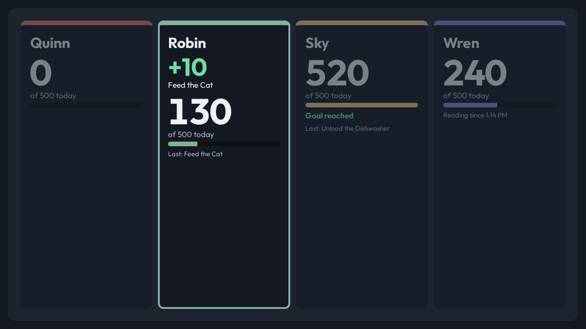
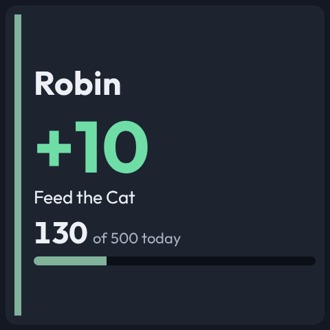
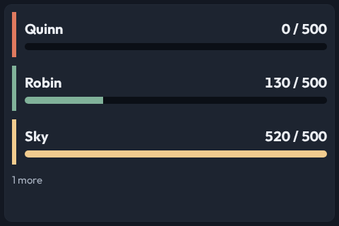

# Kids Points view

Each child's points today against the day's goal, and the result of the card a
child just scanned. A panel wide enough for every child side by side is a
board; a smaller panel gives a scan to the child who scanned.







All names and numbers in these pictures are fixture data.

CastKit never awards points. A points service decides every scan; CastKit only
draws what that service already published.

## Where the data comes from

A channel of type `kids-points.v1`. Two adapters fill it.

| Adapter | Use it when |
| --- | --- |
| **Kids Points** | A points service publishes one retained state document per child and one result message per scan. |
| **MQTT** | Something else already builds the canonical `kids-points.v1` document below and publishes it to one topic. |

The **Kids Points** adapter subscribes to two topics, both source settings:

| Setting | Default | What it carries |
| --- | --- | --- |
| `stateTopic` | `points/state/+` | One retained document per child; `+` is the child's ID. |
| `scanTopic` | `points/resp/scan` | One message per card scan, not retained. |

A child's state document:

```json
{
  "kid": "robin",
  "kidName": "Robin",
  "kidColor": "#81B29A",
  "pointsToday": 130,
  "goal": 500,
  "lastTask": "Feed the Cat",
  "runningSession": { "taskName": "Reading", "startedMs": 1763990000000 }
}
```

A scan result:

```json
{
  "kid": "robin",
  "kidName": "Robin",
  "outcome": "award",
  "points": 10,
  "pointsToday": 140,
  "goal": 500,
  "taskName": "Feed the Cat",
  "message": "Robin fed the cat.",
  "reader": "Hall Reader",
  "ts": 1763990000000
}
```

`outcome` is reduced to four results: `award` is **awarded**,
`session-start` is **started**, `session-stop` is **stopped**, and every other
outcome (too early, already done, busy) is **refused**. A refusal shows the
service's own `message`, because "Not counted" alone does not tell a child
whether to try again later. The scan's `pointsToday` updates that child's
total at once; the state document that follows confirms it.

Two channel settings narrow what a channel shows:

- `kidIds` — the children on this board. Empty is every child.
- `readers` — the card readers whose scans this channel shows. Empty is every
  reader. A room's display lists the room's own reader, so a scan in another
  room does not take it over. The picker offers each reader after its first
  scan.

A `kids-points.v1` channel never goes stale on its own. The service publishes
only when a child's day changes, and a quiet afternoon is not an outage. Set
`staleAfterSeconds` on the channel to change that.

## The contract

```ts
{
  kids: [
    {
      id: "robin",
      name: "Robin",
      pointsToday: 130,
      goal: 500,                 // optional; no goal draws no bar
      color: "#81B29A",          // optional; the child's identity color
      lastTask: "Feed the Cat",  // optional
      activeTask: {              // optional; a timer running now
        name: "Reading",
        startedAtMs: 1763990000000,
      },
    },
  ],
  lastScan: {                    // optional
    kidId: "robin",
    result: "awarded",           // awarded | refused | started | stopped
    points: 10,
    taskName: "Feed the Cat",    // optional
    message: "Robin fed the cat.", // optional
    reader: "Hall Reader",       // optional
    atMs: 1763990000000,
  },
}
```

## What the view decides

**A board is every child side by side.** The view measures its own box. When
every child fits on a card at least 220 px wide and 200 px tall, it draws a
board, one column per child, in name order so a card does not move when the
totals change. Otherwise it draws rows, and it draws only the rows that finish
on the glass, with the rest counted underneath.

**A scan holds the panel for `scanSeconds`** (default 15, the same length as
the screen override that shows a scan in a room). On a board the child who
scanned is outlined and carries the result, and the other cards dim but stay.
On a smaller panel the whole panel goes to that child: the name, the result,
the task, and the total against the goal.

**A panel too slow for the scan window never shows a scan.** A fifteen-second
result has a fifteen-second life, and the freshness rule needs ten times the
repaint time. A `slow` or `super-slow` panel shows the board or the rows, whose
totals change only when a card is scanned. A running timer is stated
absolutely — `Reading since 4:05 PM` — so it stays true on every panel.

**The identity color is a stripe and a bar, never type.** An identity color is
chosen to match printed cards, and a pale one is unreadable as text on a light
scheme. On a monochrome panel every stripe and bar is the body ink.

## Showing a scan in the room where it happened

CastKit does not know which room a reader is in; the house does. The pattern:

1. Give each room's screen a view whose Kids Points channel lists that room's
   reader in `readers`.
2. When a scan result arrives, send that room's screen a temporary override:
   `<base>/screens/<screen-id>/view/set` with
   `{"viewId":"<view-id>","durationSeconds":15,"priority":100}`.

The override brings the view up; the channel's reader filter decides which
child it shows. A board that is always on a large panel needs no override —
leave `readers` empty and every scan in the house marks its child.
