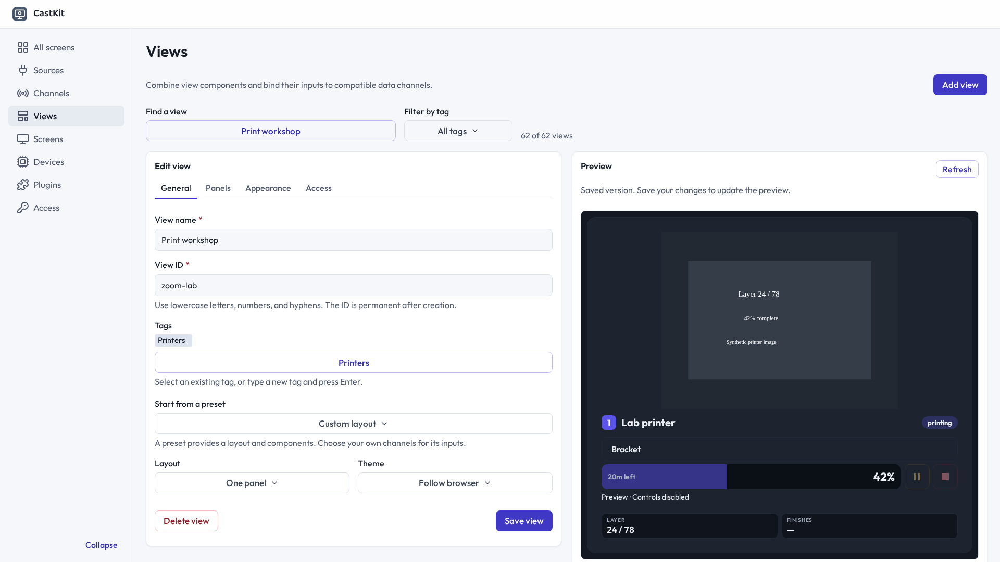
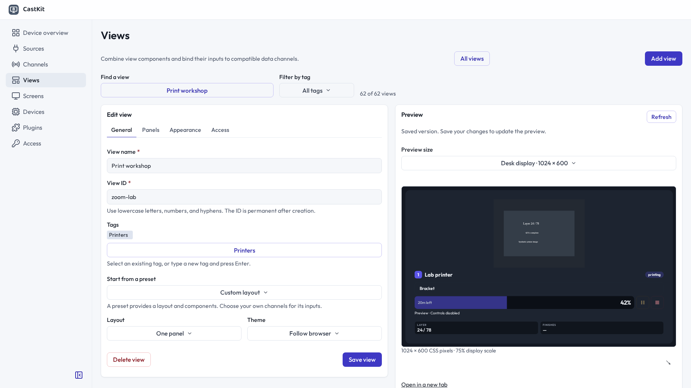
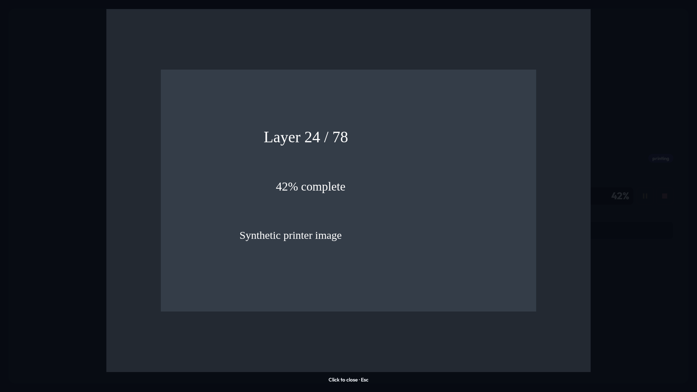
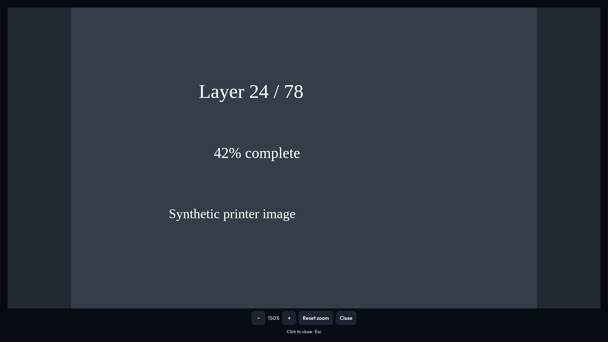
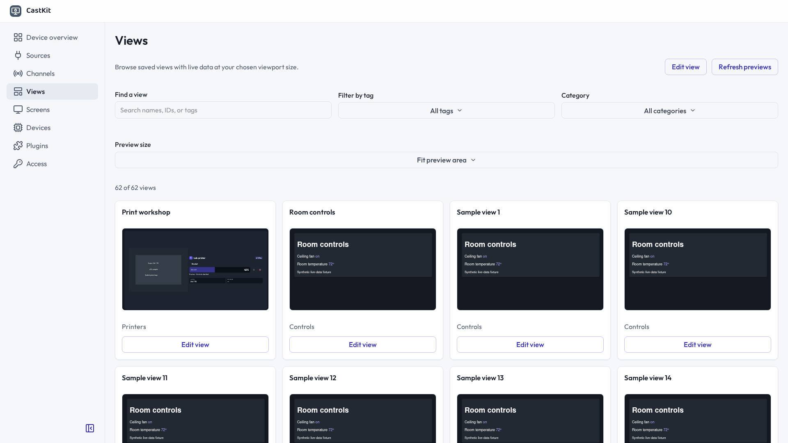

# Live preview and image zoom review

Synthetic fixtures only. The editor and lightbox comparisons use the previous
application build at `a790db8` and the current change in a 1920 × 1080 browser.
The gallery uses the management fixture and a synthetic printer channel.

| Before | After |
| --- | --- |
|  |  |
|  |  |

The self-contained [design mockup](index.html) also has
[desktop](mockup-desktop.png) and [phone](mockup-phone.png) captures.

Behavior is exercised in `e2e/previewGallery.spec.ts` and
`e2e/lightboxZoom.spec.ts` in the four shared browser windows. The latter sends
real Chromium two-contact touch input and checks pinch, pan, reset, closing,
media element preservation, and absence of control requests. Gallery checks
cover live broker updates, device/custom/current browser dimensions, filtering,
and removal of offscreen and hidden-tab iframes.
