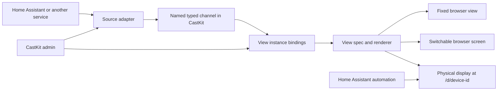

# Proposal: sources, channels, views, and browser links

**Status: For owner review. No implementation or deployment decision has been made.**

## Purpose

CastKit should render a saved view in any browser without registering a display. The same view should be usable on a physical display where its capabilities and update rate fit. People should be able to add a source or a view without making CastKit depend on one home automation system, one printer service, or one UI theme.

## Model



1. **Source adapter:** A configured input and, where supported, action endpoint. MQTT topic input is a core adapter. Optional packages can add a Home Assistant state and service connection, HTTP/API polling, or an Immich connection. The adapter converts external data into a versioned CastKit contract. A source instance has a name, connection settings, health state, and any credentials. Credentials remain on the server. CastKit's core does not need to know Home Assistant's entity model.
2. **Named channel:** A server-side stream and latest valid snapshot, addressed by a stable name such as `workbench-printers`. It records the data contract, update time, and source health. MQTT is one way to fill a channel. API results need not be published to a broker before a view can use them. An optional MQTT output can expose a normalized channel to other systems.
3. **View spec:** A registered presentation with declared input contracts, optional typed actions, settings, supported display properties, and one or more renderers. A spec can have slots or be a preset composition. It does not contain connection credentials or a fixed MQTT topic.
4. **View instance:** A saved choice of spec, channel bindings, settings, and title. The same instance can appear in a browser and on compatible physical displays. Multiple instances can share a channel, and one instance can bind several channels.
5. **Fixed browser view:** A stable URL for one view instance, such as `/view/workbench-printers`. Its slug is independent of a device ID, source URL, and display hardware. Its data changes, but its view selection stays fixed.
6. **Switchable browser screen:** A named browser target at `/screen/<screen-id>`. It has a default view, a list of allowed view instances, and a server-side active view. CastKit or a Home Assistant automation can change that active view without changing the bookmarked URL or reconfiguring the browser. Several tabs at that URL can mirror the same screen state.
7. **Physical display:** Its URL stays `/d/<device-id>`. CastKit chooses an allowed view instance from its settings or an MQTT `view/set` command. Home Assistant does not need to know how the display renders.

The word *channel* names CastKit's normalized stream. For the MQTT adapter, a channel also has a named MQTT input topic. A browser link can bind more than one channel; it does not need a separate copy of every source payload.

## Example configuration

This is a proposed data model, not a final file format or API:

```json
{
  "sources": [
    { "id": "home-mqtt", "adapter": "mqtt" },
    { "id": "photos", "adapter": "immich-api", "connection": "private-server-setting" }
  ],
  "channels": [
    { "id": "workbench-printers", "type": "printers.jobs.v1", "source": "home-mqtt", "input": "castkit/data/workbench-printers/printers/set" },
    { "id": "photo-selection", "type": "photos.selection.v1", "source": "photos" }
  ],
  "views": [
    { "id": "workbench-printers", "spec": "printer-status", "bind": { "printers": "workbench-printers" } },
    { "id": "agenda-and-photos", "spec": "agenda-photo", "bind": { "agenda": "today-agenda", "photos": "photo-selection" } }
  ]
}
```

The first browser link would be `/view/workbench-printers`. A second view instance could use the same `workbench-printers` channel alongside the built-in time source. Home Assistant keeps any printer or player group selection it already owns. CastKit selects a named channel; it does not copy that list into its own settings.

A browser screen such as `/screen/desk-side` could show that printer view by default. When a rip starts, an automation could select a `rips-and-printers` split view for this screen. When the event clears, the screen returns to its prior view. The split view binds separate rip and printer channels. It adjusts to the actual browser window size, so it can fill a monitor or one tiled half. Source updates never need to change the URL. A short-lived override needs a clear restore rule and a priority rule when two events compete.

For a large Home Assistant dashboard, an adapter can subscribe to selected entities and read their area, device, label, and state metadata from Home Assistant. A CastKit view binds those entities through named channels, then sends approved actions back through Home Assistant service calls. The source selection and layout are CastKit settings; the integration, entity values, and control logic remain in Home Assistant. Existing MQTT publishers can keep feeding views that already use them. This avoids copying every integration or building a new HA script for each dashboard card.

## Extension points

A CastKit extension package may register any combination of:

- A source adapter and its connection form, parser, credentials, and health check.
- A versioned data contract, such as `media.now-playing.v1` or `points.balance.v1`.
- A view spec with typed input bindings, settings, display capability rules, and actions.
- A browser renderer and, where appropriate, a separate renderer for server-generated images.
- A preset composition that binds several contracts to defined slots.

The view authoring API should expose data subscription hooks, settings, actions, display properties, and CSS theme variables. It must not require Charcuterie. CastKit's own admin may continue using Charcuterie; a household theme can use it too. Browser renderers can use CastKit's small Preact client, while image renderers can use the existing React/Satori path. A view package need only supply the renderers it supports.

Actions have their own contract. A view can request an operation such as `printers.pause` or `lights.set-level`; the source adapter decides how to perform it through MQTT, a Home Assistant service, or a direct API. CastKit checks the browser or display's action permission and records the result. A presentation component does not call a vendor endpoint or hold an API token.

Start with trusted packages registered when CastKit is built or started. The admin can enable and configure installed packages. The authoring contract can live in a small `@castkit/sdk` package with no Charcuterie dependency. Installing arbitrary code from a URL, a plugin marketplace, and a free-form drag-and-drop layout editor are separate later features. Preset compositions and slots provide a useful mix-and-match path now, including agenda plus photos and time plus active prints. A future builder can edit those bindings and slots without changing the source or view contracts.

## First view and source set

| View spec | Input contract | First source path |
| --- | --- | --- |
| Now Playing / Queue | `media.now-playing.v1`, `media.queue.v1` | Existing Home Assistant MQTT publisher, with named channels |
| Weather / Agenda / Time | `weather.current.v1`, `calendar.agenda.v1`, local clock | Existing Home Assistant MQTT publisher and CastKit clock |
| Photo / Agenda plus Photo | `photos.selection.v1`, optional agenda | Existing Immich API adapter, with selected image served by CastKit |
| Printer Status | `printers.jobs.v1`, optional camera media | Existing Home Assistant MQTT publisher, with named channel |
| Rip Deck | `rips.bays.v1`, poster media and commands | New adapter for Rip Deck's API or its MQTT feed, selected at setup |
| Points result | `points.balance.v1`, `points.event.v1` | MQTT or another configured adapter |

The broader dashboard migration also needs generic collections and controls: lights, fans, cameras, doors, power, timers, and alerts. These should use reusable components and typed actions over the Home Assistant source. They should not require one CastKit plugin per dashboard page. A custom view spec remains useful where a domain needs a distinct layout, such as printers or Rip Deck.

Camera media is a separate input that a desktop-capable Printer Status instance can bind. The physical workbench display can omit it through its instance settings or display capability rule. CastKit should proxy or authorize camera access without placing long-lived Home Assistant credentials in browser URLs. Source freshness and a missing-feed state must be visible.

Rip Deck migration means moving the complete kiosk presentation and interactions to a CastKit view spec, including bay rows, poster and disc details, transitions, and controls. Rip Deck continues to own the rip logic and source API. This explicitly changes the earlier decision that Rip Deck owns its kiosk page; a short superseding decision record should be written only after this proposal is approved.

An optional Home Assistant adapter also narrows the earlier decision that CastKit never reads Home Assistant directly. The existing media and printer MQTT publishers can remain, with their policy still in HA. The new adapter would serve broad dashboard data and actions through HA's existing entity model. CastKit core stays HA-agnostic; a superseding decision should state that boundary after review.

## Where settings belong

The current admin groups photo, clock, render, panel, and operational controls under **Automation settings** because they are mirrored to Home Assistant over MQTT. That label describes one way to change a value; it does not describe what the value controls. Keep one authoritative value and show it beside the object it configures. Expose a subset for automation when useful.

| Setting question | Owner in the new model | Current examples |
| --- | --- | --- |
| Which service and credentials? | Source connection | Immich URL and API key; optional Home Assistant connection |
| Which content is available? | Named channel or source query | Photo people, photo query, recency weighting, minimum people; printer or player group |
| How is that content presented? | View instance | Photo rotation interval, layout and fit, time format and timezone, date style, captions |
| How does this target render an image? | Display or browser screen output profile | Dither, color mode, brightness and saturation correction, output image format and quality |
| What are this panel's physical boundaries? | Display installation | Rotation, margins, photo crop insets for a framed panel, backlight capability |
| What is the display doing now? | Display or screen operation | Active view, update pause, current backlight level, refresh |

A view's image options are a separate **View appearance** section that applies when the view binds an image channel. They are not part of the image data contract. One image channel can feed a photo-only view and an agenda-plus-photo view with different layouts and rotation intervals. A target output profile can override image encoding and crop where the hardware requires it. Existing per-device and global settings must be migrated without losing retained MQTT values; the admin and HA automation surface must continue to write the same setting.

Replace the broad **Automation settings** card with **Sources**, **Views**, **Displays and screens**, and **Access**. A small **Automations** page can show which controls CastKit exposes to MQTT or HA and which channel names they use. It does not need a second set of values.

## Admin flow

1. Add or select a source connection. Show whether it is receiving valid data.
2. Give each needed typed output a channel name. For MQTT, show the exact topic and an example payload. Reuse an existing channel when it already represents the desired data.
3. Choose a view spec or preset composition. Bind each required input to a compatible channel. Preview the result against browser and display properties.
4. Save a view instance. The admin shows its fixed browser URL and which physical displays may use it.
5. Optionally create a browser screen. Choose its default view and allowed views, then bookmark `/screen/<screen-id>` on a desktop or kiosk browser.
6. Let CastKit or Home Assistant switch a browser screen or physical display among its allowed instances without changing its URL. The control channel for a screen is separate from every data channel.

The root page should offer **Views and browser screens**, **Manage CastKit**, and **API reference**. The first route lists saved views and lets an authorized user create a browser view or screen. The API reference should move to `/api` without changing the API routes under `/api/...`.

## Access and trust

Admin changes need authentication. A saved browser link or screen should be private by default. Before a user system exists, a view can be **public read-only** or **protected by a server-checked shared password**; an admin-only option can keep control pages private. A successful password check creates a short session in a `Secure`, `HttpOnly`, `SameSite` cookie. A browser may remember non-secret preferences locally, but a password or access token does not belong in `localStorage`. A shared password identifies access to a view, not a specific person. When Authelia is added, a trusted identity can map users or groups to view and action permissions without changing view URLs.

View access must not imply permission to issue commands. The page, its data API, media proxy, WebSocket, and action endpoint must check the same policy. The current optional `INKCAST_API_TOKEN` is a bearer token for `/api/*`; when unset, that API is open. It should move out of the device form and become a separate machine/API credential in **Access**. The browser admin should use its own login session. An HTTP source adapter needs a server-side allowlist or equivalent network restriction so an admin field cannot become an unrestricted server-side fetch. Secrets and camera tokens must stay out of public plugin settings and logs.

## Migration and review gates

1. Extract the existing view payload types and the browser cache from device IDs into named typed channels. Keep old per-device MQTT inputs working while publishers move to named topics.
2. Register existing view renderers as view specs without changing their visual behavior. Add browser instances and stable URLs.
3. Move Immich photo selection behind the same source/channel interface. Keep it as a direct API adapter internally.
4. Move Rip Deck only after its CastKit renderer and controls match the current kiosk. Add camera and points contracts as separate increments.
5. Test a fixed browser link, a switchable browser screen, a split view, the current physical display URL, HA view switching, source loss, and unauthenticated access before a merge.

The current isolated prototype couples a view directly to one MQTT channel and, for Rip Deck, to an arbitrary HTTP URL. It has no reusable source registry or composition model. It is a design spike and should be reworked before any pull request, merge, or deployment.
